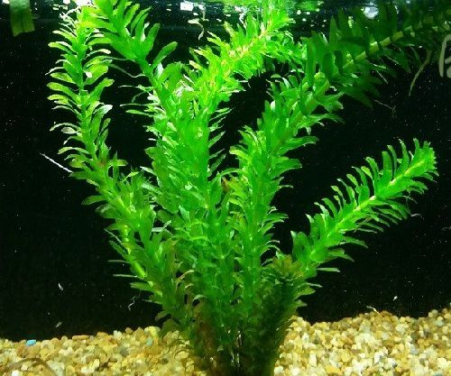
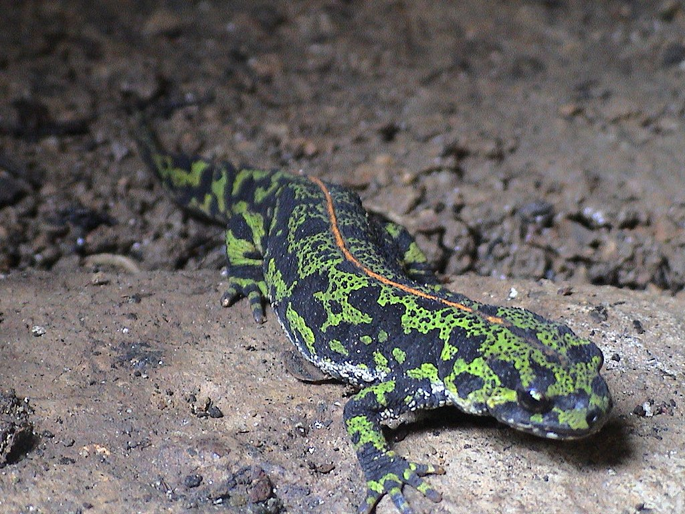
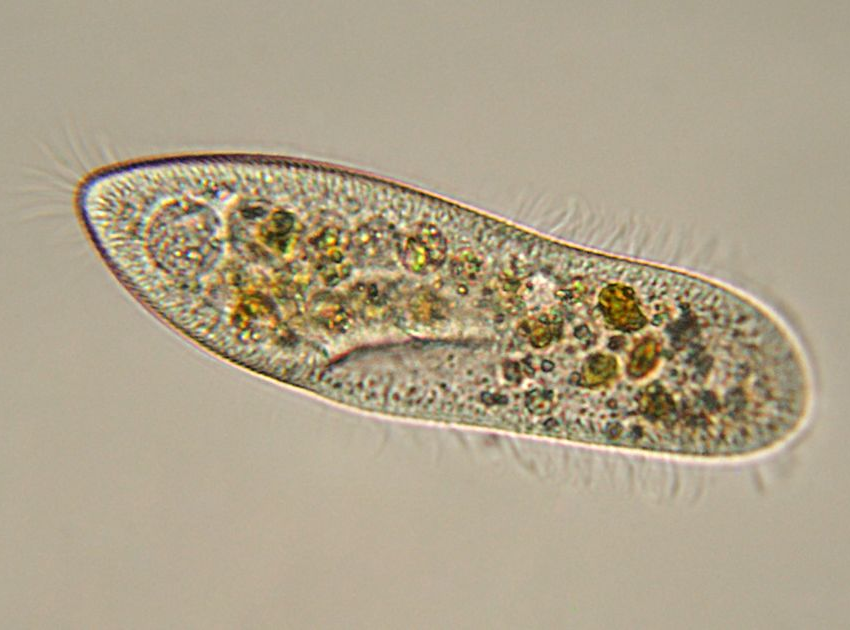
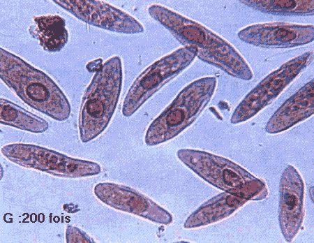
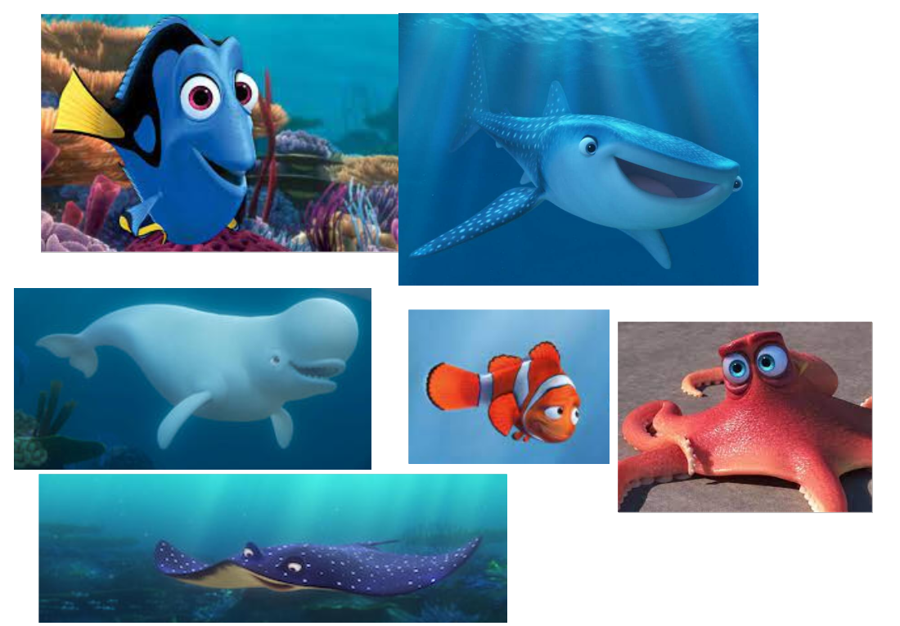

# Séquence : Les êtres vivants

!!! note-prof
    si besoin d'infos

!!! question "Problématique"

    Comment montrer la parenté de tous les êtres vivants ?

## Séance 1 : Unité du vivant

Rappel : un être vivant se nourrit, se reproduit et grandit.

Situation déclenchante : A priori, entre cette plante (élodée), ce micro-organisme (une paramécie) et moi, il n’y a pas de points communs. Pourtant on est tous classés dans le groupe des êtres vivants : c’est donc que l’on a quelque chose en commun.
Si on ne peut pas le voir à l’œil nu, comment faudrait-il faire ? 

{: style="height:200px;"}

{: style="height:200px;"}

{: style="height:200px;"}

!!! question "Problématique"

    Quel est le point commun entre tous les êtres vivants?

[Activité Observation de l’épiderme d’un triton](../obsTriton)

[Activité Observation de l’épiderme d’un oignon](../obsOignon)

[Activité Calculer la taille de ce que l’on observe au microscope](../calculTaille)

??? note "photo"
    

??? abstract "Bilan"
    Certaines choses ne peuvent pas être vues à l’œil nu, car ils sont très petits, on dit qu’ils sont microscopiques. Pour pouvoir les observer, l’être humain va utiliser un microscope.

    Tous les êtres vivants sont composés de cellules. On dit que la cellule est l’unité du vivant.

    Quand un organisme est formé d’une cellule, c’est un organisme unicellulaire. Quand un organisme est formé de plusieurs cellules, c’est un organisme pluricellulaire.

    Les cellules sont constituées d’une membrane plasmique, d’un cytoplasme et d’un noyau pour certains unicellulaires et les pluricellulaires.

## Séance 2 : Hérédité et lien de parenté

Situation déclenchante : Dans le dessin animé, Le monde de Dory, le poisson-chirurgien, part à la recherche de ses parents. Ce qu’elle ignore, c’est que toutes les espèces ont un lien de parenté.

!!! question "Problématique"

    Comment peut-on faire des liens de parenté entre les espèces d’êtres vivants ?

- Trier : c'est opérer un choix éliminatoire, à partir d'un critère donné, c'est « oui » ou « non », « a » ou « n'a pas ».
- Ranger : c'est introduire une notion d'ordre, selon un critère continu (ordre croissant, alphabétique ...).
- Classer : c'est établir des relations entre les objets afin de former des ensembles (au moins deux, souvent plus).

[Activité Des liens de parenté dans le monde de Dory](../classifDory)

[Activité Classification des végétaux ](../classifVegetauxExo)

[Activité Classification de la jaune d'un jardin](../classifJardin)

[Activité Classification exercice phylogène](../classifPhylogeneExo)

[Activité Classification exercice](../classifExo)

??? abstract "Bilan"

    Les êtres vivants peuvent être classés en fonction des attributs qu’ils possèdent sous la forme de groupes emboîtés.
    On classe dans un même groupe les êtres vivants possédant un attribut en commun.
    Plus le nombre de caractères partagés est important, plus leur lien de parenté est grand. Les êtres vivants qui ont le plus de caractères en commun sont ceux d’une même espèce. 
    
    Ils sont classés dans une classification en groupes emboîtés.
    Ces groupes emboîtés permettent de mettre en évidence les relations de parenté entre les espèces.

    Un arbre de parenté, ou arbre phylogénétique, représente les relations de parenté entre des espèces supposées avoir un ancêtre commun. Cela permet de visualiser plus facilement les liens de parents et de voir quelles espèces sont plus proches parents et comment ont évolué les espèces au cours du temps.

    Définition attribut : Caractère défini par les scientifiques qui permet d’établir des relations de parenté. Généralement ce sont des caractères anatomiques.

