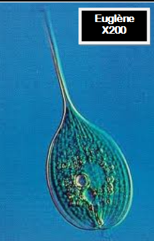
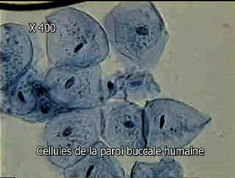
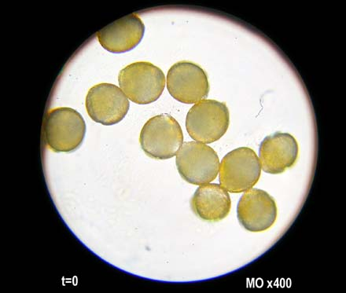

# Activité : Calculer la taille des cellules

!!! note "Compétences"

    Utiliser l'outil mathématique 

!!! warning "Consignes"

    À partir des informations, calculer la taille des 3 cellules en photos. 
    
??? bug "Critères de réussite"
    - 

Pour avoir une idée de la taille réelle d’un élément observé au microscope, il faut :
- Mesurer l’élément dont on souhaite connaître la taille sur le document
- Puis diviser par le grossissement
Cela donne une idée de la taille, mais attention si la taille photo a été agrandi ou réduite, cela va changer le résultat, il y a donc d'autres méthodes plus précises qui existent

$\text{Taille réelle de l’élément} = \frac{\text{Taille mesurée à la règle}}{\text{Grossissement du microscope}}$

Rappel : le grossissement du microscope = grossissement de l’oculaire x grossissement de l’objectif
Attention : à ne pas oublier de noter l’unité (cm, mm, µm…)

<table markdown>
<thead markdown>
<tr markdown>
<th> Photographie 		</th>
<th markdown>  		</th>
<th markdown>  		</th>
<th markdown>  		</th>
</tr>
</thead>
<tbody>
<tr>
<td> 		 		</td>
<td> Photographie d’Euglène x200			 		</td>
<td> Photographie de cellules de la bouche x400 		</td>
<td> Photographie de grains de pollen x400 		</td>
</tr>
<tr>
<td> Taille mesurée 		</td>
<td> 		 		</td>
<td> 		 		</td>
<td> 		 		</td>
</tr>
<tr>
<td> Grossissement 		</td>
<td> 		 		</td>
<td> 		 		</td>
<td> 		 		</td>
</tr>
<tr>
<td> Calcul de la taille réelle 		</td>
<td> 		 		</td>
<td> 		 		</td>
<td> 		 		</td>
</tr>
<tr>
<td> Taille réelle 		</td>
<td> 		 		</td>
<td> 		 		</td>
<td> 		 		</td>
</tr>
</tbody>
</table>
