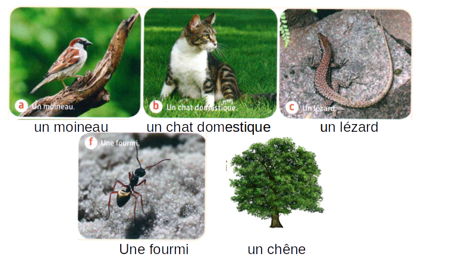

# Activité : Exercices classification

!!! note Compétences

    Communiquer sous différentes formes  

!!! warning Consignes

    1. Compléter le tableau des attributs
    2. construire les groupes emboîtés pour les êtres vivant ci-dessous.
    3. Repérer l’attribut partagé par tous les êtres vivants.
    
??? bug Critères de réussite

**Document 1 photos de quelques êtres vivants.**

<table>
<thead>
  <tr>
    <th> 			attribut  			 &nbsp;&nbsp;			 		</th>
    <th > 			Yeux 			et bouche 		</th>
        <th > 			Cellules		</th>
    <th> 			Squelette 			interne 		</th>
    <th> 			4 			membres (pattes ou ailes) 		</th>
    <th> 			Poils 		</th>
    <th> 			Plumes 		</th>
    <th> 			Squelette 			externe 		</th>
    <th> 			Pigment 			vert (couleur verte) 		</th>
  </tr>
</thead>
<tbody>
  <tr>
    <td> 			Moineau 		</td>
    <td > 			 &nbsp;&nbsp;			 		</td>
       <td > 			 &nbsp;&nbsp;			 		</td>
    <td> 			présent 		</td>
    <td> 			 &nbsp;&nbsp;			 		</td>
    <td> 			 &nbsp;&nbsp;			 		</td>
    <td> 			 &nbsp;&nbsp;			 		</td>
    <td> 			Absent 		</td>
    <td> 			Absent 		</td>
  </tr>
  <tr>
    <td> 			Chat 		</td>
    <td> 			 &nbsp;&nbsp;			 		</td>
    <td> 			 &nbsp;&nbsp;			 		</td>
    <td> 			présent 		</td>
    <td> 			 &nbsp;&nbsp;			 		</td>
    <td> 			 &nbsp;&nbsp;			 		</td>
    <td> 			 &nbsp;&nbsp;			 		</td>
    <td> 			Absent 		</td>
    <td> 			Absent 		</td>
  </tr>
  <tr>
    <td> 			Lézard 		</td>
    <td> 			 &nbsp;&nbsp;			 		</td>
    <td> 			 &nbsp;&nbsp;			 		</td>
    <td> 			présent 		</td>
    <td> 			 &nbsp;&nbsp;			 		</td>
    <td> 			 &nbsp;&nbsp;			 		</td>
    <td> 			 &nbsp;&nbsp;			 		</td>
    <td> 			Absent 		</td>
    <td> 			Absent 		</td>
  </tr>
  <tr>
    <td> 			Fourmi 		</td>
    <td> 			 &nbsp;&nbsp;			 		</td>
    <td> 			 &nbsp;&nbsp;			 		</td>
    <td> 			Absent 		</td>
    <td> 			 &nbsp;&nbsp;			 		</td>
    <td> 			 &nbsp;&nbsp;			 		</td>
    <td> 			 &nbsp;&nbsp;			 		</td>
    <td> 			présent 		</td>
    <td> 			Absent 		</td>
  </tr>
  <tr>
    <td> 			Chêne 		</td>
    <td> 			 &nbsp;&nbsp;			 		</td>
    <td> 			 &nbsp;&nbsp;			 		</td>
    <td> 			Absent 		</td>
    <td> 			 &nbsp;&nbsp;			 		</td>
    <td> 			 &nbsp;&nbsp;			 		</td>
    <td> 			 &nbsp;&nbsp;			 		</td>
    <td> 			Absent 		</td>
    <td> 			Présent 		</td>
  </tr>
</tbody>
</table>

