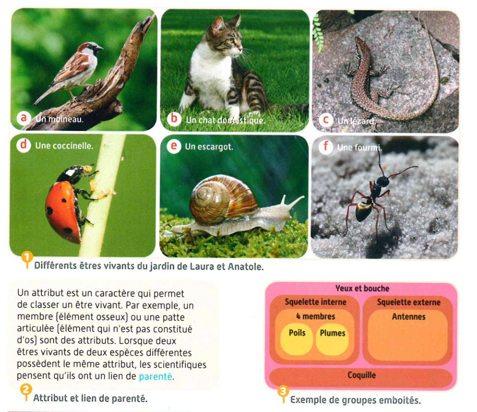
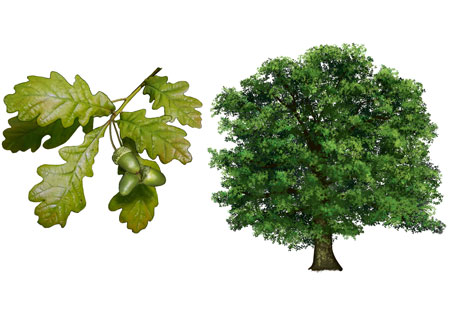
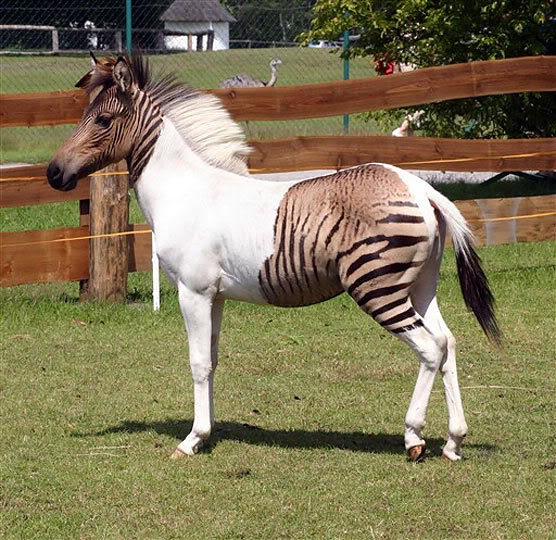

# Activité : Exercices classification

## Exercice 1

!!! note "Compétences"

    Communiquer sous différentes formes  

!!! warning "Consignes"

    1. Compléter le tableau des attributs
    2. construire les groupes emboîtés pour les êtres vivant ci-dessous.
    3. Repérer l’attribut partagé par tous les êtres vivants.
    
??? bug "Critères de réussite"
    - 

<table>
<thead>
  <tr>
    <th> 			attribut  			 &nbsp;&nbsp;			 		</th>
    <th > 			Yeux 			et bouche 		</th>
        <th > 			Cellules		</th>
    <th> 			Squelette 			interne 		</th>
    <th> 			4 			membres (pattes ou ailes) 		</th>
    <th> 			Poils 		</th>
    <th> 			Plumes 		</th>
    <th> 			Squelette 			externe 		</th>
    <th> 			Pigment 			vert (couleur verte) 		</th>
  </tr>
</thead>
<tbody>
  <tr>
    <td> 			Moineau 		</td>
    <td > 			 &nbsp;&nbsp;			 		</td>
       <td > 			 &nbsp;&nbsp;			 		</td>
    <td> 			présent 		</td>
    <td> 			 &nbsp;&nbsp;			 		</td>
    <td> 			 &nbsp;&nbsp;			 		</td>
    <td> 			 &nbsp;&nbsp;			 		</td>
    <td> 			Absent 		</td>
    <td> 			Absent 		</td>
  </tr>
  <tr>
    <td> 			Chat 		</td>
    <td> 			 &nbsp;&nbsp;			 		</td>
    <td> 			 &nbsp;&nbsp;			 		</td>
    <td> 			présent 		</td>
    <td> 			 &nbsp;&nbsp;			 		</td>
    <td> 			 &nbsp;&nbsp;			 		</td>
    <td> 			 &nbsp;&nbsp;			 		</td>
    <td> 			Absent 		</td>
    <td> 			Absent 		</td>
  </tr>
  <tr>
    <td> 			Lézard 		</td>
    <td> 			 &nbsp;&nbsp;			 		</td>
    <td> 			 &nbsp;&nbsp;			 		</td>
    <td> 			présent 		</td>
    <td> 			 &nbsp;&nbsp;			 		</td>
    <td> 			 &nbsp;&nbsp;			 		</td>
    <td> 			 &nbsp;&nbsp;			 		</td>
    <td> 			Absent 		</td>
    <td> 			Absent 		</td>
  </tr>
  <tr>
    <td> 			Fourmi 		</td>
    <td> 			 &nbsp;&nbsp;			 		</td>
    <td> 			 &nbsp;&nbsp;			 		</td>
    <td> 			Absent 		</td>
    <td> 			 &nbsp;&nbsp;			 		</td>
    <td> 			 &nbsp;&nbsp;			 		</td>
    <td> 			 &nbsp;&nbsp;			 		</td>
    <td> 			présent 		</td>
    <td> 			Absent 		</td>
  </tr>
  <tr>
    <td> 			Chêne 		</td>
    <td> 			 &nbsp;&nbsp;			 		</td>
    <td> 			 &nbsp;&nbsp;			 		</td>
    <td> 			Absent 		</td>
    <td> 			 &nbsp;&nbsp;			 		</td>
    <td> 			 &nbsp;&nbsp;			 		</td>
    <td> 			 &nbsp;&nbsp;			 		</td>
    <td> 			Absent 		</td>
    <td> 			Présent 		</td>
  </tr>
</tbody>
</table>

## Exercice 2

!!! note "Compétences"

    Communiquer sous différentes formes  

!!! warning "Consignes"

    1. Rappeler la définition d’espèce.
    2. Expliquer si le zèbre et le cheval sont de la même espèce en utilisant l’exemple du zorse
    
??? bug "Critères de réussite"
    - 

**Document 1 : le zorse.**

C’est animal est un zorse, c’est-à-dire le fils d’un zèbre et d’une jument. Cet animal est dit « hybride » et ne se rencontre pas dans la nature, car les zèbres et les chevaux sont d’espèces différentes et n’habitent pas les mêmes régions.
Ce croisement est le résultat d’une expérience dans un zoo.
Le zorse (zèbre+horse) est un animal stérile, qui n’aura donc pas de descendance.