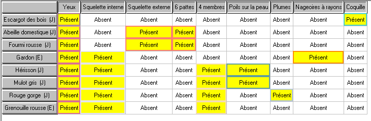
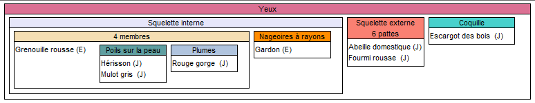
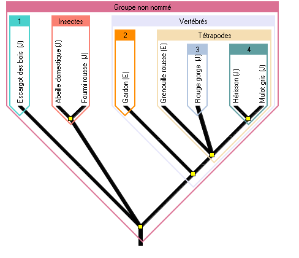

# Activité : Classification de la jaune d'un jardin

!!! note Compétences

    Communiquer sous différentes formes  

!!! warning Consignes

    1. A l'aide du logiciel Phylogène et du document créer un arbre de parenté
    2. recopier l'arbre de parenté dans votre cahier.
    3. Quelles sont les 2 espèces qui possèdent le plus de caractère en commun?
    4. Quelle est l'espèce qui présente le plus de lien de parenté avec l'abeille domestique?

    
??? bug Critères de réussite
    - 

**Document Fiche méthode du logiciel Phylogène**

1. Aller sur Phylogène et sélectionner la collection : faune jardin-étang. Appuyer sur ok.
2. Cliquer sur Activités puis construire.
3. Sélectionner les espèces suivantes : Abeille domestique, escargot des bois, fourmi rousse, gardon, grenouille rousse, hérisson, mulot gris, Rouge gorge.
4. Sélectionner les caractères suivants : 4 membres, 6 pattes, coquille, nageoires à rayon, plume, poils, squelette externe, squelette interne, yeux.
5. Compléter le tableau en cliquant sur chaque case. Vous pouvez vérifier votre tableau en cliquant sur vérifier.
6. Cliquer sur Activités puis classer. Vous pouvez déplacer les lignes et colonne du tableau de caractères.
7. Cliquer sur Afficher les boites. Puis cliquer sur les différents caractères pour faire apparaître les différentes boites.
8. Faites glisser les groupes les uns dans les autres pour les emboîter.
9. Cliquer sur Activités puis sur établir des liens de parentés.
10. Cliquer à nouveau sur Afficher les boites puis sur chaque caractères afin de faire apparaître l'arbre de parenté.
11. Cliquer sur choix puis afficher les boites de l'arbre et  le nom du groupe.

??? note-prof "correction"
    
    
    
     --> Hérisson et Mulot gris qui possèdent 4 caractères en commun.
