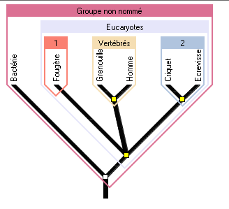
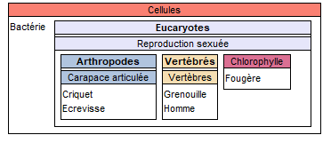

# Activité : Exercice classification phylogène

!!! note "Compétences"

    Communiquer sous différentes formes  

!!! warning "Consignes"

    1. Réaliser un arbre de parenté à partir de la collection : MNHN GAC Collège avec les espèces : bactérie, criquet, écrevisse, grenouille, homme, fougère et les caractères suivants : cellule, carapace articulée, reproduction sexuée, vertèbre, chlorophylle.
    2. Déterminer quelle est l'espèce qui a le plus de lien de parenté avec l'Homme.
    3. Quelle est l'espèce qui présente le moins de caractère en commun avec les autres espèces?
    4. Quel est le caractère propre à la fougère?

    
??? bug "Critères de réussite"
    - 

**Document Fiche méthode du logiciel Phylogène**

1. Aller sur phylogène et sélectionner la collection : faune jardin-étang. Appuyer sur ok.
2. Cliquer sur Activités puis construire.
3. Sélectionner les espèces suivantes : Abeille domestique, escargot des bois, fourmi rousse, gardon, grenouille rousse, hérisson, mulot gris, Rouge gorge.
4. Sélectionner les caractères suivants : 4 membres, 6 pattes, coquille, nageoires à rayon, plume, poils, squelette externe, squelette interne, yeux.
5. Compléter le tableau en cliquant sur chaque case. Vous pouvez vérifier votre tableau en cliquant sur vérifier.
6. Cliquer sur Activités puis classer. Vous pouvez déplacer les lignes et colonne du tableau de caractères.
7. Cliquer sur Afficher les boites. Puis cliquer sur les différents caractères pour faire apparaitre les différentes boites.
8. Faites glisser les groupes les uns dans les autres pour les emboiter.
9. Cliquer sur Activités puis sur établir des liens de parentés.
10. Cliquer à nouveau sur Afficher les boites puis sur chaque caractères afin de faire apparaitre l'arbre de parenté.
11. Cliquer sur choix puis afficher les boites de l'arbre et  le nom du groupe.

??? note-prof "correction"

