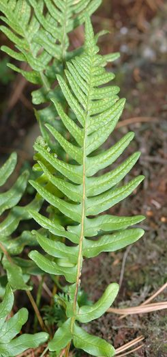
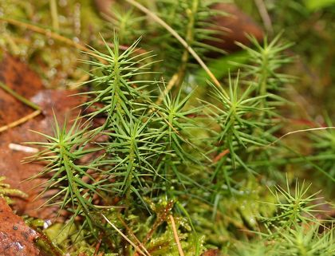
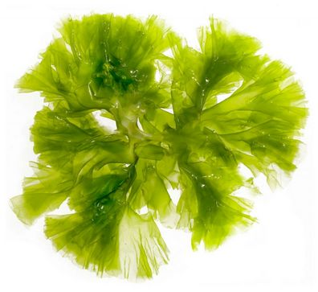
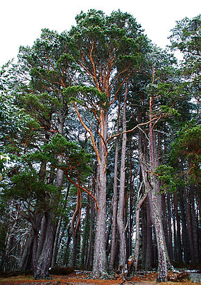

# Activité : Exercice classification des végétaux.

!!! note Compétences

    Communiquer sous différentes formes  

!!! warning Consignes

    1. En utilisant les documents et le matériel, proposer une classification des végétaux.
    2. Sachant que le sapin est dans le même groupe de que le pin sylvestre, citer les attributs que possède le sapin.
    
??? bug Critères de réussite
    - 

**Document 1 : Le polypode.**

Le polypode est une fougère. Il possède des pigments verts, une tige et des feuilles en frondes.
Taille : 50 cm.

{: style="height:200px;"}	

**Document 2 : Le cerisier.**

Le cerisier est un arbre. Il possède des pigments verts, une tige, des graines et des fleurs.
Taille: 20 m.
{: style="height:200px;"}	

**Document 3 Polytric**

Le polytric est une mousse. Il possède des pigments verts et une tige.
Taille: 5 à 10 cm.

{: style="height:200px;"}	

**Document 4 Ulve**

L’ulve est une algue. Elle possède des pigments verts.
Taille: 20 cm.

{: style="height:200px;"}	

**Document 5 Le pin sylvestre.**

Le pin sylvestre est un arbre. Il possède des pigments verts, une tige et des graines.
Taille : 35 à 40 m.

{: style="height:200px;"}	

**Document 3 : Tableau des attributs. Pour chaque être vivant, indiquer si le caractère est présent ou absent en cochant ou non la case.**

<table>
<thead>
  <tr>
    <th>    </th>
    <th > Ulve</th>
    <th> Polytric</th>
    <th> Polypode</th>
    <th> Pin sylvestre</th>
    <th> Cerisier</th>
  </tr>
</thead>
<tbody>
  <tr>
    <td> Tige</td>
    <td >    </td>
    <td>    </td>
    <td>    </td>
    <td>    </td>
    <td>    </td>
  </tr>
  <tr>
    <td> </td>
    <td>    </td>
    <td>    </td>
    <td>    </td>
    <td>    </td>
    <td>    </td>
  </tr>
  <tr>
    <td> </td>
    <td>    </td>
    <td>    </td>
    <td>    </td>
    <td>    </td>
    <td>    </td>
  </tr>
  <tr>
    <td> </td>
    <td>    </td>
    <td>    </td>
    <td>    </td>
    <td>    </td>
    <td>    </td>
  </tr>
  <tr>
    <td>  </td>
    <td >    </td>
    <td>    </td>
    <td>    </td>
    <td>    </td>
    <td>    </td>
  </tr>
  
</tbody>
</table>

**Document 4 : Images pour classif**

<table markdown>
<tbody markdown>
<tr markdown>
<td markdown> 			Cerisier 		  	{: style="height:200px;"}	</td>
<td markdown> 			Polypode 	  	{: style="height:200px;"}			</td>
<td markdown> Ulve  	{: style="height:200px;"}		</td>

</tr>

<tr markdown>
<td markdown> 			Polytric  	{: style="height:200px;"}			 		</td>
<td markdown > 			Pin 			sylvestre		  	{: style="height:200px;"}		 		</td>
<td></td>

</tr>
  <tr>
    <td> 			Feuilles en fronde 		</td>
    <td> 			Graines 		</td>
    <td> 		 		</td>

  </tr>
  <tr>
    <td> 			Fleurs 		</td>
    <td> 			Pigments verts 		</td>
    <td> 			Tige 		</td>
  </tr>
</tbody>
</table>
