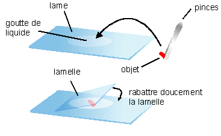
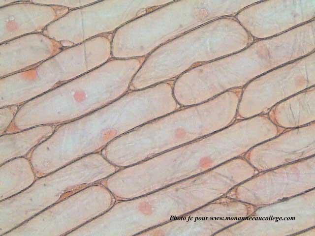

# Activité : Observation de l’épiderme d’un oignon

!!! note Compétences

    - Observation au microscope 
    - réaliser un dessin d’observation 

!!! warning Consignes

    1. Préparer une lame d’épiderme d’oignon au microscope.
    2. Observer une lame d’épiderme d’oignon au microscope.
    3. Réaliser le dessin de ton observation en utilisant les informations des documents 1 et 2.
    
??? bug Critères de réussite
    - 

**Document 1  Préparation d’une lame microscopique**

1. À l’aide d’un compte-goutte, déposer une petite goutte de colorant au centre de la lame.
2. À l’aide d’une pince fine, prélever un morceau d’épiderme d’oignon (pellicule très fine entre deux épaisseurs)
3. Le déposer sur une lame
4. Recouvrir d’une lamelle : placer un bord de la lamelle contre la goutte, l’incliner à 45° et laisser tomber la lamelle
	

**Document 2 Légendes à placer et leur définition.**
    
- Noyau : Élément arrondi à l’intérieur de la cellule
- Cytoplasme : Contenu de la cellule
- Membrane plasmique : Enveloppe qui délimite une cellule

??? note "photo"

    **Document 3 Photo d'épiderme d'oignon vue au microscope optique x400**

    