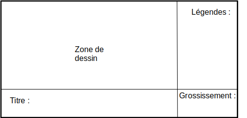
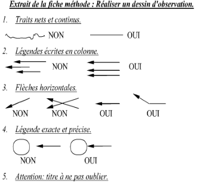
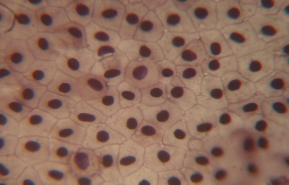

# Activité : Observation de l’épiderme d’un triton

!!! note "Compétences"

    - Observation au microscope 
    - réaliser un dessin d’observation 

!!! warning "Consignes"

    1. Observer une lame de mue de triton au microscope.
    2. Réaliser le dessin de ton observation en utilisant les informations des documents 1 et 2.
    
??? bug "Critères de réussite"
    - 

**Document 1 : Observation au microscope.**

1. Vérifier qu’on est au petit objectif (anneau rouge) pour démarrer et que l’objectif est remonté au maximum.
2. Observer nettement au petit objectif, pour cela avec la vis macrométrique (grosse vis) rapprocher l’objectif de la lame jusqu’à observer nettement l’pictures/image.
3. Grossir à l’objectif x10 (donc grossissement x100 ou x150 en fonction de leur oculaire)  
NE PAS RELEVER L’OBJECTIF quand on change de grossissement : l’observation au petit objectif a permis de trouver à peu près le bon plan d’observation pour l’objectif plus gros.
Donc on fait tourner la roulette (anneau métallique au-dessus des objectifs qui les font tourner, ne pas tourner directement les objectifs) et on passe à l’objectif x10 (anneau jaune). On ajuste un TOUT PETIT PEU le plan d’observation avec la vis micrométrique, attention si on tourne trop la lame peut casser.

**Document 2 : Fiche méthode pour réaliser un dessin d’observation**

Préparation de la feuille de dessin :

Calcul du grossissement =  Oculaire x Objectif : par exemple : 15* 4 =60   ou 15*10 = 150

<table markdown>
<thead>
<tr>
<th colspan="4"> 			Faire 			un dessin d’observation 		</th>
</tr>
</thead>
<tbody markdown >
<tr>
<td > 			Niveau 			I : Maîtrise insuffisante 		</td>
<td> 			Niveau 			F : Maîtrise fragile 		</td>
<td> 			Niveau 			S : Maîtrise satisfaisante 		</td>
<td> 			Niveau 			TB : Très bonne maîtrise 		</td>
</tr>

<tr>
<td></td>
<td> 			Au 			moins 2 critères sont correctement réalisés et le titre ou les 			légendes sont présents. 		</td>
<td> 			Au 			moins 5 critères sont correctement réalisés et le titre et des 			légendes sont présents. 		</td>
<td> 			Au 			moins 6 critères sont correctement réalisés  			 + 			Autonomie du travail. 		</td>
    
</tr>
<tr markdown ><td> 			Critères 			de réussite : 		</td>
<td  markdown colspan="3"> 			
- Exécuté au crayon à papier 				
- Traits fins et continus et dessin propre 				
- Le dessin est fidèle à l’observation 				
- Le dessin est fait à main levée 				
- Dessin suffisamment grand et centré 				
- Les traits de légendes sont horizontaux, faits à la règle et tous parallèles, ne se croisent pas et la pointe touche l’élément désigné 				
- La légende est inscrite au bout du trait 				
- Un titre est présent sur le dessin indiquant l’objet observé, le mode d’observation (Microscope Optique [MO], loupe binoculaire…) et le grossissement utilisé.  				
- ex : dessin d’observation de XXX (MOx150) </td>
</tr>
</tbody>
</table>

**Document 3 Légendes à placer et leur définition.**
    
- Noyau : Élément arrondi à l’intérieur de la cellule
- Cytoplasme : Contenu de la cellule
- Membrane plasmique : Enveloppe qui délimite une cellule

??? note "photo"

    **Document 4 Photo de mue de triton vue au microscope optique x400**

    

