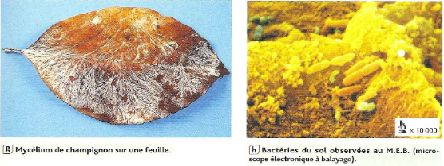
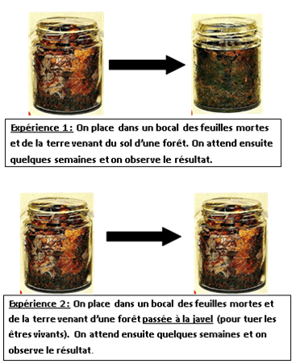
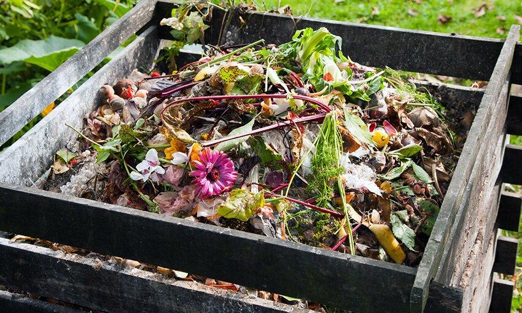

# Activité : Le devenir de la matière organique

!!! note Compétences

    - Interpréter 
    - Argumenter

!!! warning Consignes

    1. Montrer l'importance des champignons et des bactéries dans la décomposition
    2. Expliquer ce que devient la matière organique décomposée
    3. Expliquer pourquoi le compost peut favoriser le développement des plantes
    
??? bug Critères de réussite
    - 

**Document 1 Les décomposeurs.**

La litière est la partie superficielle d’un sol forestier, elle est formée de feuilles mortes, de débris végétaux et d’animaux en décomposition.
La matière organique morte est dégradée par des petits organismes vivant dans le sol, appelés décomposeurs.

La décomposition est la transformation de la matière organique en matière minérale (eau, dioxyde de carbone, et sels minéraux)

**Document 2 Rôle des champignons et bactéries dans la décomposition**

Protocole : 

1. placer dans deux pots des feuilles mortes et de la terre venant d’une forêt.
2. Dans un des deux pots, stériliser la terre en versant de l’eau de javel, pour tuer les êtres vivants
3. Attendre plusieurs semaines
4. Observer le résultat

**Document 3 le fonctionnement d’un composteur**

Un bac à compost permet de valoriser facilement certains déchets organiques, principalement les épluchures de légumes et de fruits.

À l’intérieur de ce bac, il y a des êtres vivants que l’on trouve dans les sols des forêts. On trouve des bactéries, des champignons et des petits animaux comme des lombrics.

Au fil des semaines, la matière organique de ces déchets subit une décomposition.
Après quelques mois, les déchets se transforment en une sorte de terre humide presque noire appelée compost.

Le compost peut être utilisé à la place des engrais chimiques pour favoriser la croissance des plantes.
Les engrais chimiques permettent d'apporter des minéraux supplémentaires aux plantes pour les aider à mieux se développer.

