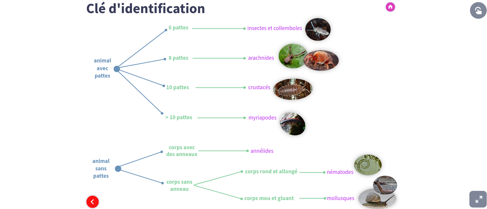
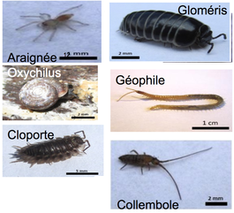
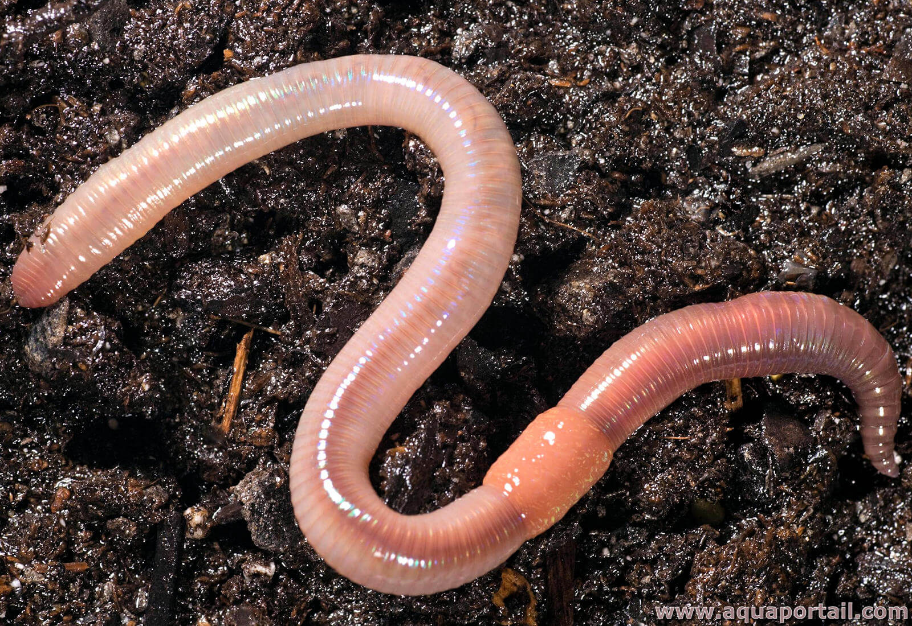

# Activité : Le devenir de la matière organique

!!! note "Compétences"

    Trouver et utiliser des informations 

!!! warning "Consignes"

    1. Identifier les êtres vivants du sol obtenus à l'aide d'un appareil de berlèze.
    2. Construire le réseau alimentaire du sol sur le document 1.

    
??? bug "Critères de réussite"
    - 

**Document 1 L'appareil de Berlèze**

Un appareil de Berlèze permet de prélever les animaux présents dans le sol, même les plus petits. A cause de la lumière et de la chaleur, les animaux vont descendre dans l'entonnoir et finir par tomber dans la boite de pétri.

**Document 2 résultat d'un berlèze**

**Document 3 Clé d'identification de la microfaune**

**Document 4 Le réseau alimentaire du sol.**

**Document 5 Régime alimentaire des êtres vivants du sol.**
|  Êtres vivants |  Régime alimentaire |
|---------|------------------------------|
|  Géophile  |  Ver de terre, petit collembole, grand collembole      |
|  Lombric (Ver de terre) |  Feuille quel que soit son état de dégradation |
|  collembole |  Champignon, feuille partiellement dégradée ou feuille non dégradée |
|  champignon |   feuille non dégradée |
|  cloporte  |  feuille partiellement dégradée |
|  araignée  |  cloporte |
|  Acarien   |  Feuille dégradée, Acarien |
|  oxychilus(escargot) |  feuille non dégradée |
|  Bactérie  |  Feuille quel que soit son état de dégradation |
|  gloméris  |  feuille partiellement dégradée |

