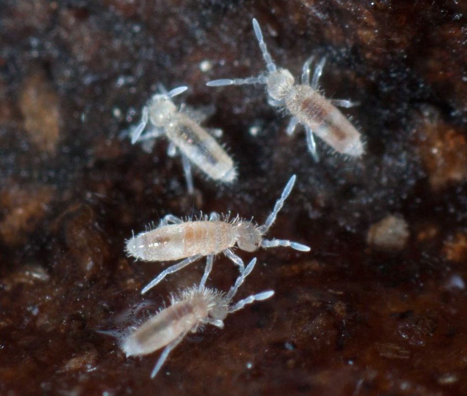

# Activité : La faune du sol

!!! note Compétences

    - Trouver et utiliser des informations 
    - réaliser un schéma

!!! warning Consignes

    1. Identifier les êtres vivants du sol obtenus à l'aide d'un appareil de berlèze.
    2. Construire le réseau alimentaire du sol sur le document 5.

    
??? bug Critères de réussite
    - 

**Document 1 L'appareil de Berlèze**

Un appareil de Berlèze permet de prélever les animaux présents dans le sol, même les plus petits. A cause de la lumière et de la chaleur, les animaux vont descendre dans l'entonnoir et finir par tomber dans la boite de pétri.

**Document 2 Résultat d'un berlèze**

{: style="width: 300px"}
{: style="width: 300px"}
{: style="width: 300px"}
{: style="width: 300px"}
{: style="width: 300px"}
{: style="width: 300px"}
{: style="width: 300px"}
{: style="width: 300px"}
{: style="width: 300px"}

**Document 3 Clé d'identification de la microfaune**

**Document 4 Régime alimentaire des êtres vivants du sol.**

|  Êtres vivants |  Régime alimentaire |
|---------|------------------------------|
|  Géophile (myriapode) |  Ver de terre, petit collembole, grand collembole      |
|  Lombric (annélide) |  Feuille quel que soit son état de dégradation |
|  collembole (insecte) |  Champignon, feuille partiellement dégradée ou feuille non dégradée |
|  champignon |   feuille non dégradée |
|  cloporte (crustacé)  |  feuille partiellement dégradée |
|  araignée  |  cloporte |
|  Acarien   |  Feuille dégradée, Acarien |
|  oxychilus (gastéropode) |  feuille non dégradée |
|  Bactérie  |  Feuille quel que soit son état de dégradation |
|  gloméris (myriapode)  |  feuille partiellement dégradée |

**Document 5 Le réseau alimentaire du sol.**

{: style="width: 800px"}