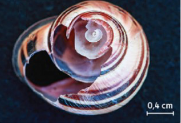

# Activité : Les réseaux alimentaires

!!! note Compétences

    -  Trouver et exploiter des informations
    -  Réaliser un schéma

!!! warning Consignes

    1. À partir des différents documents et des éléments présentés sur les tables, tracer le réseau alimentaire indiquant les relations alimentaires entre les différents êtres vivants identifiés dans les documents. 
    2. Indiquer en une phrase de quels types de matières ont besoins les animaux.
    3. À partir de tes réponses précédentes justifier que les végétaux sont des producteurs primaires.
    
??? bug Critères de réussite
    - 

**Document 1 Un réseau alimentaire.**

Les animaux ont besoin d’eau, qui est de la matière minérale. Ils doivent aussi trouver dans leur milieu de vie d’autres éléments pour produire leur propre matière organique. On dit que ce sont des producteurs secondaires, contrairement aux végétaux qui sont de producteurs primaires.
Un réseau alimentaire est une succession de chaîne alimentaire. Une chaîne alimentaire montre les relations entre les êtres vivants. Celui qui précède est mangé par celui qui le suit. Attention la flèche indique est mangé par (exemple : herbe → mouton), cela correspond au fait que la matière organique de l’herbe passe au mouton.

**Document 2 Pelote de réjection laissé par une chouette hulotte et mandibule trouvée dans cette pelote**

Les pelotes de réjections sont des boules produites par les rapaces, comme les chouettes. Ils rejettent par leur bec cette boule qui contient tout ce qu’ils ne peuvent pas digérer. 

{: style="width: 200px"}
{: style="width: 400px"}

**Document 3 Coquille d’escargot vidé par un prédateur.**

**Document 4 L’escargot et une feuille de noisetier.**

**Document 5 Des cônes d’épicéa mangés par différents animaux**

{: style="width: 400px"}
{: style="width: 350px"}

**Document 6 Clé de détermination des mâchoires des êtres vivants**

**Document 7 Clé de détermination de l’animal ayant mangé un cône d’épicéa**

**Document 8 Clé de détermination du prédateur en fonction de l’état de la coquille d’escargot.**

**Document 9 Clé de détermination de l’animal ayant mangé une noisette.**

