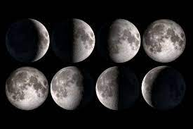

# Séquence : La rotation de la Terre
!!! note-prof
    si besoin d'infos

## Séance 1 : Alternance Jour/Nuit

Durant l’Histoire, savoir si le Soleil tourne autour de la Terre, fixe au milieu de l’Univers (modèle géocentrique) ou si la Terre tourne sur elle-même et autour du Soleil (modèle héliocentrique) a longtemps été sujet de débat. Les simples observations du phénomène jour/nuit ne permettent pas de trancher. Ce n’est qu’au XVII siècle, avec les observations des satellites de Jupiter que les premiers arguments naissent pour invalider le modèle géocentrique. 

**Document : Mouvement du Soleil dans le ciel par rapport à un observateur sur Terre**
](Pictures/mvtSoleilCiel.png)

!!! question "Problématique"
    En quoi l’alternance jour/nuit ne permet-elle pas de trancher pour un modèle en particulier ?

[Activité Alternance jour/nuit](../JourNuit)

2 vidéos en directe de l'autre côté de la planète
<iframe width="560" height="315" src="https://www.youtube.com/embed/hWbt2eVCEe8?si=xiEI_xSySJnCgPnQ" title="YouTube video player" frameborder="0" allow="accelerometer; autoplay; clipboard-write; encrypted-media; gyroscope; picture-in-picture; web-share" allowfullscreen></iframe>
Vidéo streaming Alaska

<iframe width="560" height="315" src="https://www.youtube.com/embed/tBh-ZhIB1Nk?si=AysilMHIuWNnI32R" title="YouTube video player" frameborder="0" allow="accelerometer; autoplay; clipboard-write; encrypted-media; gyroscope; picture-in-picture; web-share" allowfullscreen></iframe>
Vidéo streaming Hawaï

??? abstract "Bilan"
    De notre point vue, le Soleil se déplace dans le ciel de l'est vers l'ouest, c'est le mouvement apparent du Soleil.
    En réalité, la Terre tourne sur elle même en 24h.
    Cette rotation entraîne l'alternance entre le jour et la nuit.
    Sur 24h, un lieu passe dans la lumière du Soleil, c'est la journée, puis dans l'ombre, c'est la nuit.
    Au même moment, lorsque c'est la jour à endroit, c'est la nuit à d'autres.

## Séance 2 : Phases de la Lune

Mercredi 23 août 2023, l’Inde a réussi à faire atterrir le robot Pragyan de la mission Chandrayaan-3 dans l’hémisphère sud de la Lune. Cette mission a pour but d’étudier les sols lunaires. Le satellite naturel de la Terre reste encore aujourd’hui un sujet d’étude important et les premières traces d’études se sont axées sur son aspect variant dans le ciel au fil des nuits.

!!!question "Problématique"
    Comment expliquer l’aspect changeant de la Lune dans le ciel nocturne ?

[Activité Phases de la Lune](../phasesLune)

[Activité exercice de révision sur les vitesses](../VitesseExerciceLune)
VitesseExerciceLune

??? abstract "Bilan"

## Séance 3 : Les saisons

!!!question "Problématique"

[Activité Vitesse](../Vitesse)

??? abstract "Bilan"

## Séance 2 : Phases de la Lune

!!!question "Problématique"

[Activité Vitesse](../Vitesse)

??? abstract "Bilan"

