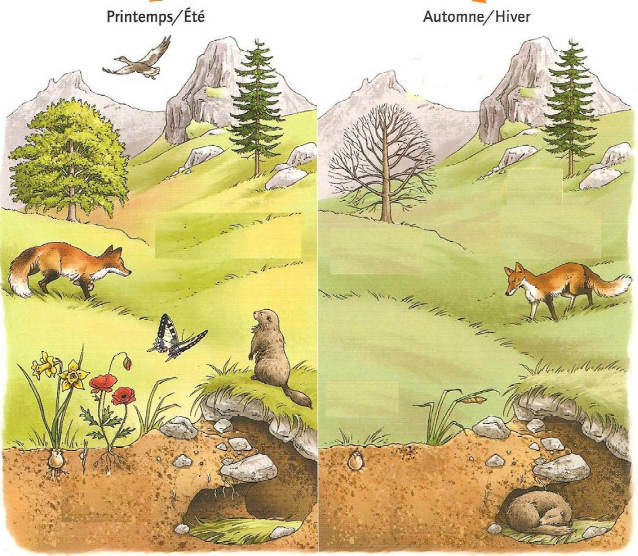

# Séquence : La rotation de la Terre
!!! note-prof
    si besoin d'infos

## Séance 1 : Alternance Jour/Nuit

Durant l’Histoire, savoir si le Soleil tourne autour de la Terre, fixe au milieu de l’Univers (modèle géocentrique) ou si la Terre tourne sur elle-même et autour du Soleil (modèle héliocentrique) a longtemps été sujet de débat. Les simples observations du phénomène jour/nuit ne permettent pas de trancher. Ce n’est qu’au XVII siècle, avec les observations des satellites de Jupiter que les premiers arguments naissent pour invalider le modèle géocentrique. 

**Document : Mouvement du Soleil dans le ciel par rapport à un observateur sur Terre**
](Pictures/mvtSoleilCiel.png)

!!! question "Problématique"
    En quoi l’alternance jour/nuit ne permet-elle pas de trancher pour un modèle en particulier ?

[Activité Alternance jour/nuit](../JourNuit)

2 vidéos en directe de l'autre côté de la planète
<iframe width="560" height="315" src="https://www.youtube-nocookie.com/embed/hWbt2eVCEe8?si=fK99FagtwtzdCd5e" title="YouTube video player" frameborder="0" allow="accelerometer; autoplay; clipboard-write; encrypted-media; gyroscope; picture-in-picture; web-share" allowfullscreen></iframe>
Vidéo streaming Alaska

<iframe width="560" height="315" src="https://www.youtube-nocookie.com/embed/76rwjwc07DI?si=PsWVBlLWdmBW01e1" title="YouTube video player" frameborder="0" allow="accelerometer; autoplay; clipboard-write; encrypted-media; gyroscope; picture-in-picture; web-share" allowfullscreen></iframe>
Vidéo streaming Hawaï

??? abstract "Bilan"
    De notre point vue, le Soleil se déplace dans le ciel de l'est vers l'ouest, c'est le mouvement apparent du Soleil.
    En réalité, la Terre tourne sur elle même en 24h.
    Cette rotation entraîne l'alternance entre le jour et la nuit.
    Sur 24h, un lieu passe dans la lumière du Soleil, c'est la journée, puis dans l'ombre, c'est la nuit.
    Au même moment, lorsque c'est la jour à endroit, c'est la nuit à d'autres.

[Activité exercice de révision sur les vitesses](../VitesseExerciceLune)
VitesseExerciceLune

## Séance 2 : Les saisons

La Terre n’est pas « parfaitement droite » par rapport à sa révolution autour du Soleil. En effet, elle est inclinée de 23° et c’est cette inclinaison qui est responsable des saisons. Sur Terre, un observateur n’observe pas l’inclinaison de la Terre mais celle du Soleil. 

!!!question "Problématique"
    Comment cette inclinaison peut-elle avoir un impact sur les saisons ?

[Activité sur les saisons](../Saison)

??? abstract "Bilan"
    L'inclinaison du Soleil fait que la durée des journées et des nuit varient au cours de l'année. 
    De plus, moins le Soleil est haut dans le ciel, moins il fait chaud. 
    Les saisons changent donc en fonction de l'inclinaison du Soleil et de la durée du jour.
    Dans l'hémisphère nord, le jour le plus long correspond au solstice d’été (21 juin) et que le jour le plus court correspond au solstice d’hiver (21 décembre). Lors des équinoxes (21 mars et 21 septembre), la durée du jour est égale à la durée de la nuit.

## Séance 3 : 

!!!question "Problématique"
    Comment varie le peuplement du milieu au cours des saisons ?

[Activité ](../peulementSaisons)

??? abstract "Bilan"

    Au cours des saisons, les paramètres physiques de l’écosystème varient : dans notre exemple, la température est plus chaude en été qu’en hiver. Les êtres vivants sont sensibles aux changements de la température. Quand la température diminue, les êtres vivants ont différents comportements : migration, hivernation, hibernation, perte des feuilles, survie de la descendance.

