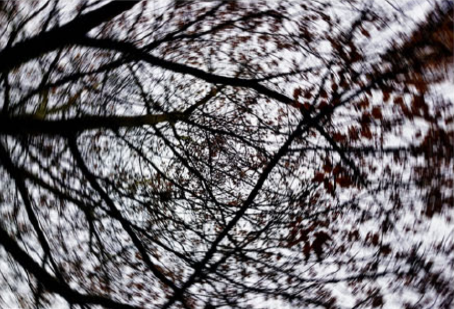
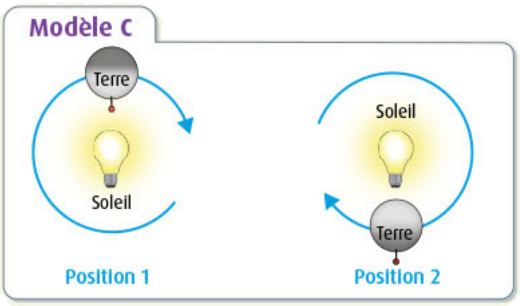

# Activité : Alternance jour/nuit

!!! note "Compétences"
    - Manipuler

!!! warning "Consignes"
    Consigne 1 : Dans le document 1, pour chaque photo indiquer qui semble en mouvement et par rapport à qui ?  
    Consigne 2 : Dans les modélisations du document 3, indiquer ce que représente le ballon et la lampe dans la réalité.  
    COnsigne 3 : Réaliser les 3 modélisations du document 2 et indiquer pour chacun s'il y a une alternance jour/nuit pour le repère.  
    Consigne 4 : Parmi les trois modèles, indiquer celui qui modélise l’alternance du jour et de la nuit du point de vue d’un observateur sur Terre ? Justifier.
   
   
??? bug "Critères de réussite"
    - Indiquer pour chaque photo d'où est prise la photo et qu'est-ce qui semble en mouvement

**Document 1 mouvement depuis deux points de vue différents**

<iframe title="Mouvement Tourniquet" width="1020" height="630" src="https://tube-sciences-technologies.apps.education.fr/videos/embed/3751319f-b6f6-48ba-aa71-75c7c4594c3e" frameborder="0" allowfullscreen="" sandbox="allow-same-origin allow-scripts allow-popups"></iframe>

**Document 1A : Mouvement d’un tourniquet par rapport à un observateur sur la terre ferme**

**Document 1B : Mouvement des arbres par rapport à un observateur dans le tourniquet**

**Document 2 : Modélisation du mouvement de la Terre**

Protocole : 
mettre un bout de ruban adhésif (le repère) sur le ballon, qui modélisera la Terre, puis reproduisez les trois modèles ci-contre.  
Observer si le ruban adhésif passe de l’ombre à la lumière.

|  Modèle     |  Photo  |
| ---- | ---- |
|   Modèle A : après avoir fixé la Terre pour qu’elle reste immobile, munissez-vous de la lampe (le Soleil) et effectuez une trajectoire circulaire autour de la Terre   |      |
|   Modèle B : Après avoir fixé la lampe pour qu’elle reste immobile, munissez-vous de la Terre et faites-la tourner sur elle-même  |      |
|    Modèle C : Après avoir fixé la lampe pour qu’elle reste immobile, munissez-vous de la Terre et effectuez une trajectoire circulaire autour de la lampe.   |      |

