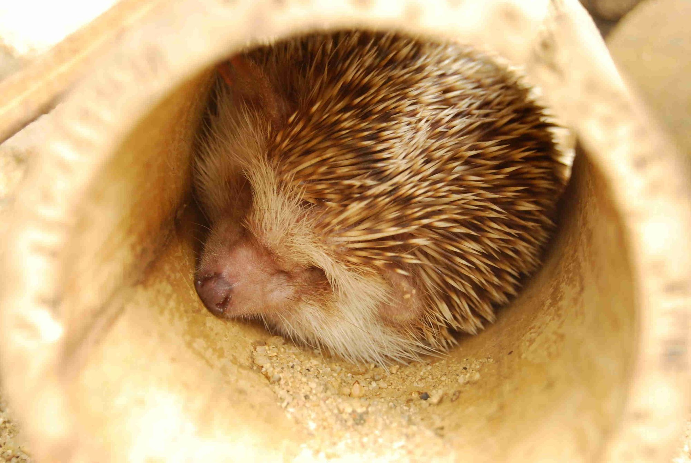

# Activité : Alternance jour/nuit

!!! note "Compétences"
    - Trouver et exploiter des informations
    - Manipuler

!!! warning "Consignes"
    1) Dans le document 1A, qui semble en mouvement et par rapport à qui ?  
    2) Dans le document 1B, qui semble en mouvement et par rapport à qui ?  
    3) Dans le document 1C, qui semble en mouvement et par rapport à qui ?  
    4) À l’aide des réponses précédentes, proposer une hypothèse pour décrire le mouvement de la Terre par rapport à un observateur qui serait situé sur le Soleil.  
    5) Parmi ces trois modèles, quel est celui qui modélise l’alternance du jour et de la nuit du point de vue d’un observateur sur Terre ? Justifier.
   
   
!!! bug "Critères de réussite"

**Document 1A : Mouvement d’un tourniquet par rapport à un observateur sur la terre ferme**

**Document 1B : Mouvement des arbres par rapport à un observateur dans le tourniquet**

**Document 1C : Mouvement du Soleil dans le ciel par rapport à un observateur sur Terre**

**Document 1D : Timelapse du mouvement du Soleil dans le ciel par rapport à un observateur sur Terre**

**Document 3 Modèlisation du mouvement de la Terre**

Expérimentation

Enfoncer une punaise de couleur dans la boule de polystyrène, qui modélisera la Terre, puis reproduisez les trois modèles ci-contre. Observer si la punaise passe de l’ombre à la lumière.

Modèle A : après avoir fixé la Terre pour qu’elle reste immobile, munissez-vous de la lampe (le Soleil) et effectuez une trajectoire circulaire autour de la Terre

Modèle B : Après avoir fixé la lampe pour qu’elle reste immobile, munissez-vous de la Terre et faites-la tourner sur elle-même

Modèle C : Après avoir fixé la lampe pour qu’elle reste immobile, munissez-vous de la Terre et effectuez une trajectoire circulaire autour de la lampe. 

