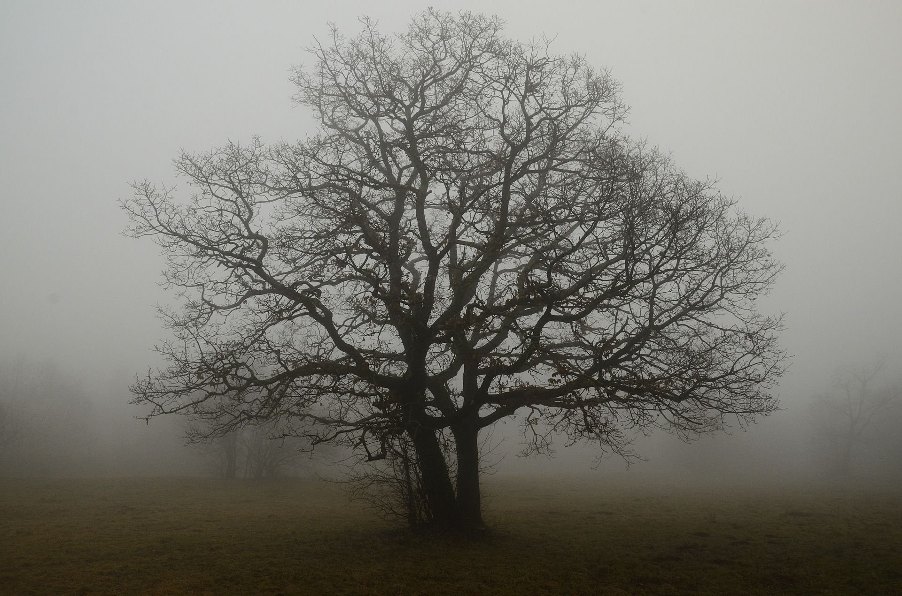

# Activité : Modification du peuplement au cours des saisons

!!! note "Compétences"
    - Trouver et utiliser des informations

!!! warning "Consignes"
    Complète le tableau pour indiquer pour els différents êtres vivants leur solution pour passer l'hiver.
   
   
??? bug "Critères de réussite"
    - comparer dans chaque document,c e que fait l'être vivant en été ou printemps avec l'hiver.
    - conclure sur la façon dont il passe l'hiver

**Document 1 : Le renard en hiver**

{: style="width:300px "}

Le renard roux hiverne. Sa fourrure d’épaissit en hiver lui permettant de résister à des températures de - 15°C. Dans son territoire, il creuse plusieurs terriers dans la neige pour rester à l’abri du froid, surtout la nuit. La quête de nourriture peut être compliquée en hiver, mais le renard possède une ouïe fine et un odorat très développé qui l’aident à capturer ses proies. 

{: style="width:300px; flex: 1 2 1 " }

**Document 2 : Le hérisson en hiver**
Durant l’été, chaque nuit, le hérisson part à la recherche de sa nourriture : vers de terre, insectes, escargots, serpents, champignons, racines… À la fin de l’été, il construit son nid à l’aide de feuilles, brins d’herbe et mousse.
À l’automne, dès que la température s’abaisse en dessous de 10 °C, le hérisson entre en hibernation. Bien à l’abri dans son nid, il dort longuement, la température de son corps diminue, son cœur bat moins vite, sa respiration est très lente.
Vers le mois de mars ou d’avril, il reprend sa vie active.
L'hibernation est un processus permettant à des animaux de passer l'hiver dans un état de sommeil profond, avec une température corporelle proche de 0 °C dans certains cas.
 

**Document 3 : L’hiver des hirondelles** ou 
La migration d’automne des hirondelles débute quand la nourriture disponible diminue. Elles se dirigent alors vers le sud et beaucoup passent l’hiver dans les pays d'Afrique du Centre-Ouest. 
Au printemps, les grues repartent vers le nord pour se reproduire.

**Document 4 : Le chêne**
Le chêne est une espèce d’arbre à feuilles caduques, c’est-à-dire qui tombent en hiver. La perte des feuilles du chêne lui permet de mieux supporter l’hiver et ses très basses températures, en évitant de perdre de l'eau par exemple. Durant l'hiver, il y a également arrêt de la circulation des sèves. Cette « mise au ralenti » de l’arbre permet une forte économie d’énergie (arrêt de la photosynthèse, de la croissance, etc.).
 

**Document 5 : Le Dahlia**
Pour être sûre de toujours en avoir mes fleurs préférées dans mon jardin, j’ai planté des bulbes de dahlia. Au printemps, les fleurs éclosent en une symphonie de couleur ! Elles fanent assez vite, mais je sais qu’en laissant les bulbes dans le sol pendant l’hiver, l’année d’après, mon jardin sera de nouveau rempli de dahlias !
			 	 
**Document 6 : Le coquelicot**
J’adore aussi les coquelicots, mais une fois la fleur fanée, à la fin du printemps, la plante meurt… Elle ne laisse que de toutes petites graines, qui vont s’envoler et se répandre dans tout le jardin ! Après l’hiver, les graines vont pouvoir germer et mon jardin va être rouge de nouvelles fleurs ! 

**Document 7 : La fourmi**
La pause hivernale (appelée diapause) est une période cruciale pour la colonie. C’est le seul moment de l'année où l'activité de la colonie est mise en pause : arrêt de la ponte de la reine, ralentissement du rythme de travail des ouvrières, etc. Pendant cette période, la colonie se nourrit assez peu. C'est pourquoi les colonies ont tendance à faire des réserves de nourriture juste avant le repos hivernal.
 
| Être vivant | Différences de forme ou comportement entre le printemps/été et l’hiver | Solution pour passer l’hiver |
|----|----|----|
| Chêne | | |
| Dahlia  | | |
| Coquelicot  | | |
| Renard  | | |
| Hérisson  | | |
| Hirondelle  | | |

**Document 3 : Résumé des informations de l’animation**

Quand il fait trop froid, certains être vivants……………… vers des pays plus chauds comme………………… ; certains………………… (c’est à dire que leur fourrure s’épaissit et qu’ils adaptent leur alimentation), comme le………………… ; d’autres………………… (c’est à dire qu’ils dorment durant toute la saison), comme le………………… et les………………… ; d’autres perdent leur………………… pour éviter la……………………………, comme le……………; d’autres……………………… mais leur descendance survit dans le sol sous forme de…………… ou de bulbes, comme les…………………………………………………………………