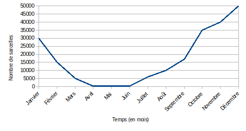
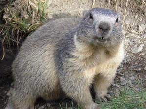

# Activité : Exercices de révision sur les graphiques

!!! note "Compétences"
    - Trouver et utiliser des informations
    - Construire un graphique
    - Décrire un graphique

## Exercice 1

!!! warning "Consignes"
    
    1. Indiquer ce que représente l’ordonnée du graphique.
    2. Indiquer ce que représente l’abscisse du graphique.
    3. Indiquer le mois de l’année où il y a le plus de sarcelles d’hiver en Camargue.
    4. Préciser quel est l’effectif de sarcelles d’hiver à ce moment-là.
    5. Indiquer les mois de l’année où il y a le moins de sarcelles d’hiver en Camargue.
    6. Indiquer l’information extraite de ce graphique en recopiant et complétant le document 3.

**Document 1 : la sarcelle d’hiver**

La Sarcelle d’hiver est un oiseau migrateur.
En été, les sarcelles d’hiver se nourrissent et se reproduisent sur les lacs de Scandinavie ou au nord de la Russie. Ces lacs sont en partie gelés en hiver.
En hiver, les sarcelles d’hiver sont présentes dans des aires d’hivernage au sud de l’Europe, notamment en Camargue, où elles se nourrissent de graines enfouies dans la vase.

{: style="width:200px;  flex-shrink: 0; " }

**Document 2 : Graphique de l’évolution de la population de la Sarcelle en Camargue au cours d’une année.**

**Document 3 :**

« Les sarcelles d’hiver arrivent en Camargue, sur leur aire d’hivernage, dès le mois de -------. Elles repartent vers leurs lieux de reproduction en Scandinavie dès le mois de --------. Ces allers-retours appelés migrations leur permettent de trouver de la ------------ tout au long de l’année »

## Exercice 2

!!! warning "Consignes"
    
    1. À l’aide du tableau ci-dessus, construire le graphique représentant l’évolution de la masse de la marmotte en fonction du temps.
    2. Décrire le graphique obtenu.

**Document 1 : La marmotte des Alpes**

Les marmottes des Alpes vivent en petites colonies familiales entre 1000 et 3000 mètres d’altitude. A l’approche de l’automne, elles aménagent, au fond de leur terrier, une chambre tapissée d’herbes sèches. Dans le courant de l’automne, elles ferment l’entrée depuis l’intérieur et s’endorment d’un profond sommeil entrecoupé de brèves périodes de réveil : on dit qu’elles hibernent. Elles ne se nourrissent pas jusqu’au mois d’avril.

{: style="width:200px;  flex-shrink: 0; " }

**Document 2 : Evolution de la masse de la marmotte au cours de l’année.**

| Mois de l'année | Masse de la marmotte en Kg|
|:---------------:|:----------------:|
| Janvier         | 3,8                |
| Février         | 4              |
| Mars            | 4,1              |
| Avril           | 4,3               |
| Mai             | 5              |
| Juin            | 5,2               |
| Juillet         | 5,3              |
| Août            | 5,4             |
| Septembre       | 5,1              |
| Octobre         | 4,7              |
| Novembre        | 4,4              |
| Décembre        | 3,9              |

