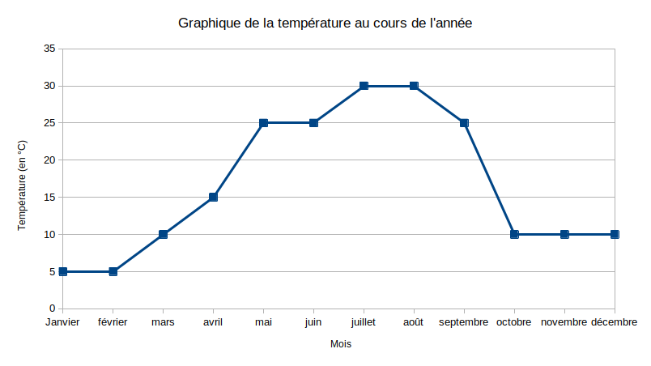

# Activité : Modification du comportement des êtres vivants pendant la mauvaise saison

!!! note Compétences
    - Trouver et utiliser des informations
    - Construire un graphique
    - Décrire un graphique

!!! warning Consignes

    1. A partir des informations du document 3, construire une graphique de l'évolution du nombre d'espèces en fonction des mois. (Aidez-vous de la fiche méthode du document 1)
    2. A partir des informations du document 4, décrire l’évolution de la température moyenne au cours de l’année dans l’environnement étudié. (Aidez-vous de la fiche méthode du document 2)
    3. A partir des deux graphiques, comparer la température et la quantité d'espèces entre l'été et l'hiver.
   
??? bug Critères de réussite
    - avoir bien vérifier que tous les critères de la réalisation d'un graphique ont été réalisés.
    - avoir bien vérifier que tous les critères de la description d'un graphique ont été réalisés.

**Document 1 : Résumé de la méthode pour construire un graphique**

Un graphique est composé de 2 axes que l’on appelle : l’abscisse (celui du bas) et l’ordonnée (celui du haut). C’est toujours l’ordonnée qui varie en fonction de l’abscisse.
Exemple d’une consigne : Tracer le graphique représentant l’évolution du prix du pain en fonction des années. Le prix du pain sera en ordonnées. Les années seront en abscisse.
Une fois que les axes sont bien placés, on les gradue : on décide, pour chaque axe, de la valeur d’un carreau. Il y a toujours le même écart entre deux graduations d’un même axe.
Ensuite, on place les points sur le graphique, on les relie à main levée. Et, on donne un titre. voir : [hachette-clic.fr/23st6040](hachette-clic.fr/23st6040)

**Document 2 : Résumé de la méthode pour décrire un graphique**

Décrire un graphique revient à présenter l’évolution de la grandeur étudiée. On commence par écrire une phrase d’introduction présentant les grandeurs étudiées. (exemple : Ce graphique représente la température en fonction de l’heure de la journée)
Il faut commencer par compter le nombre de segments qu’il y a dans la courbe : il faudra rédiger autant de phrases qu’il y a de segments. Rédiger une phrase par segment de courbe. Chaque phrase comporte l’un des verbes suivants : augmenter, diminuer ou rester stable.
Chaque phrase indique le moment de début et de fin et les valeurs du phénomène mesuré.
Remarque : c’est le phénomène mesuré sur l’axe vertical qui évolue ; il ne faut donc pas dire que la courbe augmente ou diminue, mais que la grandeur étudiée augmente ou diminue.

**Document  3 : Quantité d'espèces au cours de l'année**

| MOIS DE L’ANNÉE | NOMBRE D’ESPÈCES |
|:---------------:|:----------------:|
| Janvier         | 3                |
| Février         | 3                |
| Mars            | 10               |
| Avril           | 20               |
| Mai             | 25               |
| Juin            | 25               |
| Juillet         | 20               |
| Août            | 20               |
| Septembre       | 20               |
| Octobre         | 10               |
| Novembre        | 10               |
| Décembre        | 3                |

**Document 4 : Graphique de l'évolution de la température au cours de l'année**

