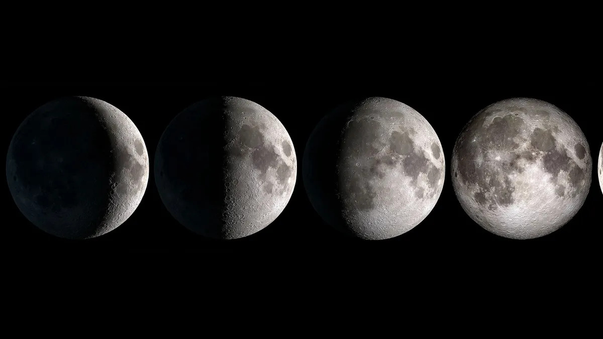
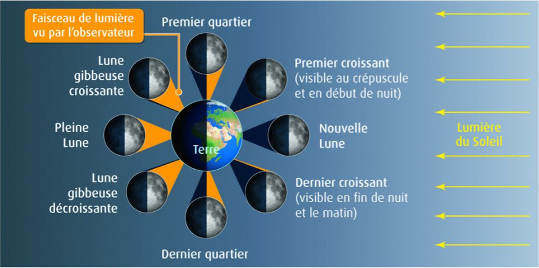
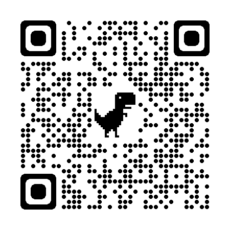

# Activité : Les phases de la Lune

!!! note "Compétences"
    - Trouver et utiliser des informations

!!! warning "Consignes"
    1) De quelle source provient la lumière qui se reflète sur la Lune et qui permet de la voir ?  
    2) Identifier les 4 phases lunaires du document 1 et trouver leur nom grâce au document 2.  
    3) Schématiser ces 4 positions de la Lune selon le point de vue d’un observateur situé sur Terre en faisant apparaître les rayons lumineux.
   
   
??? bug "Critères de réussite"
    - Indiquer pour chaque photo d'où est prise la photo et qu'est-ce qui semble en mouvement
    - Avoir réalisé les 3 modélisations
    - Pour chacune 

**Document 1 Quatre phases lunaires**

La phase lunaire, ou phase de la Lune, désigne la portion de la Lune illuminée par le Soleil et observée depuis la Terre

**Document 2 : Huit positions de la Lune autour de la Terre**

**Document 3 : Modélisation**

<iframe width="560" height="315" src="https://www.youtube.com/embed/eNsqAUopQRw?si=lEAc5CuW_1zrfUvr" title="YouTube video player" frameborder="0" allow="accelerometer; autoplay; clipboard-write; encrypted-media; gyroscope; picture-in-picture; web-share" allowfullscreen></iframe>