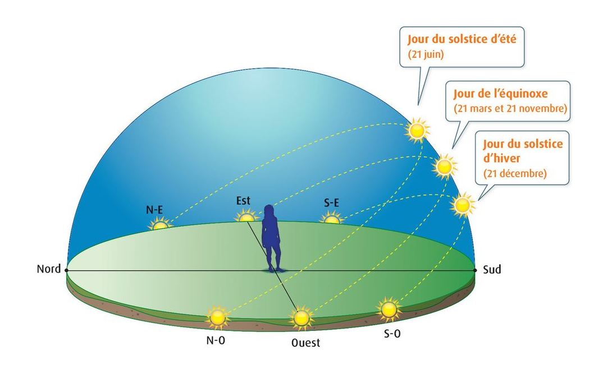
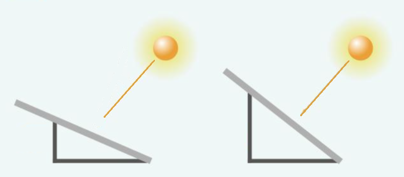

# Activité : Les saisons

!!! note "Compétences"
    - Trouver et utiliser des informations

!!! warning "Consignes"
    1) Quelle est la saison durant laquelle les journées sont plus longues ?  
    2) Comparer la hauteur maximal du Soleil, et donc son inclinaison dans le ciel par rapport à un observateur sur Terre, en été et en hiver.  
    3) En vous appuyant sur le document 4, un observateur et son environnement reçoivent-t-ils autant d’énergie lorsque le Soleil est très incliné ou peu incliné par rapport à un observateur sur Terre ?  
    4) Expliquer alors pourquoi il y a une saison où il fait plus froid et une autre plus chaud (s’appuyer sur le document 2 et les réponses aux questions précédentes).
   
   
??? bug "Critères de réussite"
    - Indiquer la saison avec la journée la plus longue
        - avoir indiquer pour chaque mois à quelle saison, il correspond
        - comparer les durées pour chaque mois.
    - Comparer la hauteur du soleil dans le document 2.
    - Comparer l'intensité lumineuse en fonction de l'inclinaison du Soleil.
        - avoir indiquer ce que représente chaque élément de la modélisation
        - faire la manipulation et noter le résultat obtenu à chaque étape.
    - Donner une réponse à la problématique, en utilisant les trois réponses précédentes.

**Document 1 : Durée de l’ensoleillement**

| Date | Durée |
|---|---|
| 21/12/2022 | 08h21min |
| 21/03/2023 | 12h10min |
| 21/06/2023 | 16h11min |
| 21/11/2023 | 12h10min |
| 21/12/2023 | 08h23min |

**Document 2 : Température moyenne à Paris sur un mois**

| Mois | Température |
|---|---|
| Mars |11,3 °C |
| Juin |21,8 °C |
| Novembre | 8,8 °C |
| Décembre | 6,3 °C |

**Document 3 : La position du Soleil dans le ciel (hémisphère Nord)**

**Document 4 : Modélisation**

Expérience :

- Allumer l’application Phyphox
- Placer la tablette proche d’une source lumineuse
- Incliner la tablette et observer la valeur « intensité lumineuse »