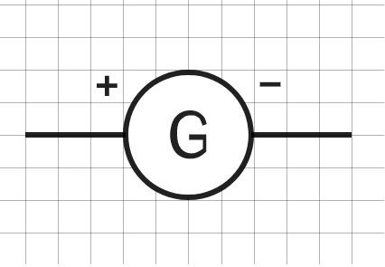
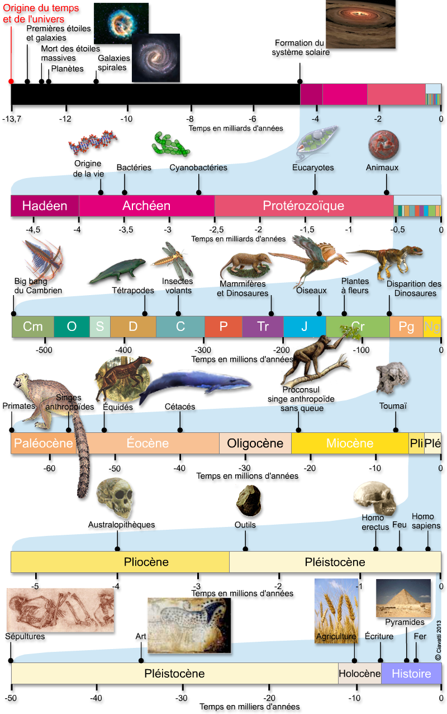

_url_img: "https://chatbotmethodes-3858eb.forge.apps.education.fr/Pictures/"

Lien vers un chatbot pour aider dans les fiches méthodes.

[chatbot](https://chatmd.forge.apps.education.fr/#https://chatbotmethodes-3858eb.forge.apps.education.fr/chatbotmethodes.md)

Le chatbot est réalisé avec CHatMD de Cédric Eyssette.

# Outils d'aide en Sciences

Je suis un chatbot pour vous aider à créer ou analyser un document en sciences.

1. [Je recherche une méthode précise](A Faire)
2. [Je cherche à comprendre la consigne](Comprendre la consigne)
3. [Je cherche à apprendre mon cours](Apprendre son cours)

--- 

## A Faire

Que faut-il faire ?

1. [Décrire un graphique](Décrire un graphique)
2. [Réaliser un graphique](Réaliser un graphique)
3. [Construire un tableau](Construire un tableau)
4. [Réaliser un dessin](Réaliser un dessin)
5. [Réaliser un schéma structurel](Réaliser un schéma structurel)
6. [Faire un schéma fonctionnel](Réaliser un schéma fonctionnel)
7. [Démarche scientifique et analyse d'expérience](Démarche scientifique et analyse d'expérience)
8. [Comparer des données]
9. [Analyser des documents]
10. [Construire un modèle]
11. [Utiliser un microscope](Utiliser un microscope)
12. [Rédiger une réponse](Rédiger une réponse/mettre en relation des informations)
13. [Réalisation d’une préparation microscopique](Réalisation d’une préparation microscopique)
14. [Schématisation électrique](Schématisation électrique)
15. [Notions d'échelles spatiales et temporelles](Notions d'échelles spatiales et temporelles)
16. [Construire des groupes emboîtés](Construire des groupes emboîtés)
17. [Calculer une taille ou distance sur une photo ou une carte](Calculer une taille ou distance sur une photo ou une carte)

--- 

## Comprendre la consigne

Je ne comprends pas ce qu'il faut faire dans la consigne

1. Commencer par lire la consigne en entier
2. Chercher les mots difficiles et s'assurer que l'on en comprenne le sens
3. Repérer les mots importants :
  - Verbe d'action qui indique quoi faire
  - Mots indiquant la production attendue (schéma, texte, tableau ...)
  - Mots indiquant où trouver les informations

 

**Verbe Action "simple"**

- NOMMER : donner un nom
- INDIQUER : donner une information en rédigeant une phrase.
- IDENTIFIER/RELEVER/TIRER/TROUVER : Rechercher une information dans un document
- DÉCRIRE : Dire ce que l’on voit dans un document sans donner d’explication.
- LISTER/CITER : Énoncer un ou plusieurs éléments sans donner d’explications.
- CONSTRUIRE / TRACER : À l’aide d’ustensiles spécifiques construire une représentation
- CALCULER : Effectuer un calcul chiffré.
- DESSINER : Faire un dessin d’observation.
- SCHÉMATISER : Faire un schéma
- DÉCRIRE : Permet d’expliquer un document à l’aide des éléments qui le constituent
- CLASSER : Mettre dans des catégories
- ÉTABLIR UN LIEN, ASSOCIER, RELIER : Mettre en relation avec des connecteurs logiques

**Verbe Action "complexe"**

- MONTRER/DÉMONTRER : Construire un raisonnement scientifique (je vois que...je sais que...j’en déduis que ...)
- JUSTIFIER : Expliquer pourquoi on a choisi cette réponse (parce que ... car...)
- EXPLIQUER : Expliquer les causes et les conséquences  (J'observe... je sais que...j'en déduis que...)
- COMPARER : Faire une comparaison, c’est-à-dire trouver les points communs et différences entre 2 éléments.
- DÉDUIRE : Établir une conséquence logique
- ANALYSER : Construire un raisonnement scientifique.
- DÉTERMINER : S’exprimer en faisant une phrase afin de résoudre un problème ou une question en se basant sur le cours ou les documents.  (J'observe... je sais que...j'en déduis que...)
- FORMULER UNE HYPOTHÈSE : Proposer une solution qui n’est pas encore démontrée, mais qui doit être possible. (Je pense que… Je suppose que…)
- CONCLURE : Faire le bilan après une explication

--- 

## Apprendre son cours

La mémoire ne peut pas être efficace sur du court terme (la veille du devoir), il faut la réactiver régulièrement pour que les informations soient retenues de manière efficace sur le long terme. Si ce n'est pas le cas, les informations seront oubliées.

### En classe

- Écouter attentivement.
- Participer activement.
- Prendre le cours entièrement et correctement.
- Poser des questions lors d'une difficulté de compréhension.

### À la maison

- Relire régulièrement le cours le soir.
- Réciter plusieurs fois le cours.
- Faire des fiches révisions, une fiche contient les idées principales du cours (définitions, mots clés ...)
- Faire des flashcards, avec des questions portant sur le cours sur le devant de la carte et les réponses sur le dos de la carte, pour s’entraîner- En cas de questions, les noter pour les poser au cours suivant.
- Lorsqu'une évaluation est prévue prévoir trois périodes de révision minimum (1 semaine avant, 3 jours avant et la veille).

--- 

## Réaliser un dessin

Dans un dessin, la représentation doit être la plus fidèle possible (taille, forme ...).

Le dessin se fait au centre de la feuille, on représente l'objet observé ou une partie de façon assez grosse pour être lisible.

Il est possible de faire un cadre avec 4 pour ne rien oublier.

- Réaliser un dessin propre, sans rature ou blanc.

- Mettre une légende
   - Traits fins faits à la règle
   - Traits parallèles (ne se croisent pas)
   - Traits horizontaux 
   - Traits qui sont tous alignés
   - Les noms au bout des traits

- Mettre un titre 
   - On met un titre avec  le type de document  (dessin) + ce qu’il représente (+ Mode d’obtention : microscope, loupe avec le grossissement)
   -  GROSSISSEMENT / ÉCHELLE
   Grossissement : uniquement au microscope (objectif x oculaire)

   Échelle : mesurer la longueur du segment présent sur le document

--- 

## Réaliser un schéma structurel

Un schéma est une représentation simplifié de la réalité. Il ne faut donc pas tout représenter. Les tailles et les formes ne sont pas forcément respectées. Il montre l'organisation, la structure d’un élément.

Le schéma se fait au centre de la feuille, on représente l'objet observé ou une partie de façon assez grosse pour être lisible.

Il est possible de faire un cadre avec 4 pour ne rien oublier.

- Réaliser un schéma propre sans rature ou blanc.

- Mettre une légende
   - Traits fins faits à la règle
   - Traits parallèles (ne se croisent pas)
   - Traits horizontaux 
   - Traits qui sont tous alignés
   - Les noms au bout des traits

La légende peut être aussi sous la forme de figuré ou de symbole

- Mettre un titre 
   - On met un titre avec  le type de document (schéma) + ce qu’il représente (+ Mode d’obtention : microscope, loupe avec le grossissement)
   -  GROSSISSEMENT / ÉCHELLE
   Grossissement : uniquement au microscope (objectif x oculaire)

   Échelle : mesurer la longueur du segment présent sur le document

--- 

## Décrire un graphique

- Indiquer quel est le paramètre (ou variable) mesuré (paramètre A).
- Expliquer en fonction de quel paramètre fixe a été mesuré le paramètre A (paramètre B).
- Pour les graphiques simples, sans trop de variations
   - Compter le nombre de segments qu’il y a dans la courbe : 
   - il faudra rédiger autant de phrases qu’il y a de segments. Rédiger une phrase par segment de courbe. Chaque phrase comporte l’un des verbes suivants :
     -  augmenter, 
     -  diminuer 
     -  ou rester stable.
   - Chaque phrase indique le moment de début et de fin et les valeurs du phénomène mesuré.
   Remarque : c’est le phénomène mesuré sur l’axe vertical qui évolue ; il ne faut donc pas dire que la courbe augmente ou diminue, mais que la grandeur étudiée augmente ou diminue.
   - Pour les graphiques plus complexes, avec beaucoup de variations:
   Il faut donner les les minimums et maximums et décrire les tendances, par exemple, voit-on régulièrement les mêmes variations = cycle.

Exemple : 
Ce graphique représente la température en fonction de l’heure de la journée. 
De 0 h à 6 h, la température est à 8°C, donc la température est constante à 8 °C. 
De 6 h à 14 h, la température passe de 8 à 30°C, donc elle  augmente. 
De 14 h à 24 h, la température passe de 30 à 8°C, donc elle diminue.

---

## Réaliser un graphique

Un graphique se construit :
- au crayon de papier, 
- sur papier millimetré,
- à partir d’un tableau de données.

• Étape 1 : Grâce à la consigne, déterminer les deux grandeurs à reporter sur les axes :    
  - le paramètre mesuré -> ordonnée (vertical)
  - le paramètre variable -> abscisse (horizontal)
C’est toujours l’ordonnée qui varie en fonction de l’abscisse.
La consigne sera le plus souvent écrite avec : « paramètre mesuré EN FONCTION du paramètre variable »  

• Étape 2 : Tracer le repère avec les 2 axes gradués et les légender en placant une unité

• Étape 3 : Déterminer l'échelle pour graduer les axes :
  - repérer pour chaque paramètre les valeurs maximales et minimales à placer.
  - trouver une graduation en adéquation avec ces valeurs  «1 en 1, 2 en 2, 5 en 5, 10 en 10, 100 en 100 ».
  - graduer les axes en respectant l'écart entre chaque graduation.

• Étape 4 : Placer les points en faisant correspondre les coordonnées présentes dans le tableau de résultats. Une valeur mesurée correspond à une valeur du paramètre variable. 

- Chercher sur l’axe des ordonnées la valeur et faire un trait horizontal en pointillé.
- Chercher sur l’axe des abscisses la valeur et faire un trait vertical en pointillé.
- Quand les deux traits se croissent, mettre un « + » (et non un point ou une croix)
- Refaire les mêmes étapes pour chaque couple de valeur.

• Étape 5 : relier les points à la main et mettre un titre

• Étape 6 : Mettre un titre et le souligner.
Exemple type : Graphique de Ordonnée en fonction de l’abscisse. (Remplacer « ordonnée et
abscisse par les grandeurs physiques de l’exercice)

Exemple : Réaliser le graphique de l’évolution de la température en fonction du temps.
C’est toujours l’ordonnée qui varie en fonction de l’abscisse.

L’ordonnée est toujours avant le « en fonction de » : ici c’est la température.
L’abscisse est toujours après le « en fonction de » : ici c’est le temps.

--- 

## Réaliser un schéma fonctionnel

- Il explique le fonctionement de quelque chose.
- On utilise des formes géométriques et des flèches pour les déplacements.  
- La légende reprend les formes utilisées et en donne leur signification.  
- La légende peut être indiquée par des flèches, directement sur le schéma ou dans une légende à part.

Étapes de réalisation :
1. lister les éléments indispensables à mettre dans le schéma
2. réfléchir à l'ordre des éléments
3. représenter de façon simple les éléments en utilisant des formes géométriques
4. établir des relations entre les éléments par des flèches (attention au sens des flèches)
5. Mettre un titre

Exemple de schéma fonctionnel

Schéma fonctionnel de l'influence du nombre de carnivores sur la végétation

--- 

## Construire un tableau

Un tableau permet de regrouper des informations pour mieux les comparer.

Il y a deux types de tableaux : 
- tableau à simple entrée qui servent surtout à classer
  
| **Europe**  | **Asie**  | **Afrique**  |
| -- | -- | -- |
| France | Japon  | Namibie  |
| Espagne | Thaïlande  | Ghana  |

- tableau à double entrée qui permettent de comparer des informations.

|  | **France**    | **Espagne**  |
| -- | -- | -- |
| **Capitale** |  Paris | Madrid  |
| **Population** | 68 millions  |  47 millions |

Tableau comparant la France et l'Espagne

Pour construire un tableau à double entrée :

1. Il faut commencer par identifier le nombre de lignes et de colonnes en regardant 
NB : Il faut ajouter une ligne et une colonne de plus pour ajouter les légendes.
Exemple : Constuire un tableau pour comparer la présence des constituants (membrane, cytoplasme, noyau, ADN) des cellules animales et ceux d’une bactérie.
Il y a 2 types de cellules et 4 composants donc le tableau fera 3 x 5.

2. Choisir l’orientation du tableau pour que ce soit plus harmonieux sur la page

3. Construire le tableau en traçant toutes les lignes et les colonnes : votre tableau doit être entièrement refermé pour toutes les cases.
   - Une ligne doit toujours faire la même hauteur du début à la fin
   - Une colonne doit toujours faire la même largeur du début à la fin

4. Compléter la première ligne et la première colonne avec les titres (bien relire la question pour ne rien oublier).

5. Compléter l’ensemble du tableau.

6. Mettre un titre

--- 

## Rédiger une réponse/mettre en relation des informations

Relire la consigne et bien la garder en tête.
Chercher des informations utiles en observant dans le(s) document(s).
Surligner ou souligner les informations utiles.
Une information est utile lorsqu’elle est en RAPPORT AVEC LA QUESTION !

Question simple
- Souvent 1 seul document
- Extraire l’information utile
- Rédiger votre réponse en reprenant les mots de la question.

Question complexe
- Souvent plusieurs documents
- Extraire l’information utile de chacun des docs
- Rédiger votre réponse en METTANT EN RELATIONS VOS INFORMATIONS
- Ajouter, parfois, vos CONNAISSANCES
  
RÉDIGER UNE RÉPONSE SCIENTIFIQUE COMPLEXE

- Étape 1 : OBSERVER
Extraire les informations utiles des documents pour répondre à la question, en indiquant dans quel document est trouvé l'information.
« Je vois que... », « j’observe que... », « je constate que... », « je remarque que »
- Étape 2: INTERPRÉTER
Lorsque c’est nécessaire ajouter vos connaissances
« or je sais que... », « d’après mes connaissances ...»
- Étape 3: CONCLURE
Rédiger votre réponse au problème.
« J’en conclus que...», « donc»
Lorsque vous vérifiez une hypothèse il faut dire dans la conclusion si votre hypothèse est validée ou invalidée.

A la fin, relire la consigne et la réponse pour vérifier que cette réponse réponde bien à la consigne.

--- 

## Démarche scientifique et analyse d'expérience

La démarche scientifique est l'ensemble des étapes utilisées par les scientifiques pour répondre à un problème.

1. Observation :    Phénomène qui conduit à une question.
2. Problème :   Question scientifique à laquelle on veut répondre
3. Hypothèse :   Réponse possible au problème, la démarche scientifique permettra de la vérifier. Dans le cas d'une démarche expérimentale, on fera les étapes suivantes.
4. Protocole : Étapes pour réaliser l'expérience, chaque étape contient un verbe d'action à l'infinif. L'expérience doit posséder deux tests minimum avec un seul paramètre variable.
5. Résultats attendus : Indiquer quels devraient être les résultats pour les tests si l'hypothèse est vraie.
6. Expérimentation : Faire l'expérience
7. Résultats observés : Indiquer quels sont les résultats obtenus
8. Interprétation : On compare les résultats observés avec ceux attendus pour indiquer si l'hypothèse est validée ou réfutée. Dans le cas où elle est validée, on passe à la conclusion, si elle est réfutée, on en formule une nouvelle.
9. Conclusion : Répondre au problème.

Lorsque l'on vous demande d'analyser une expérience, vous devez rédiger les étapes 3, 4, 5, 7, 8 et 9.

--- 

## Utiliser un microscope

Le microscope est un outil qui permet d’observer des objets ou des êtres vivants microscopiques qui sont généralement invisibles à l’oeil nu. Comme les loupes il va permettre de grossir ce que l’on observe à l’aide d’objectifs.

C’est un outil fragile : il est donc primordial d’en prendre le plus grand soin !

Utilisation

1. On transporte toujours le microscope en le prenant par la potence avec une main et l'autre main en dessous
2. La lame doit être bloquée par les valets sur la platine, l'objet doit être placé au dessus du trou de la platine
3. Allumer le microscope et régler la luminosité.
4. On commence toujours à observer à l’objectif rouge (x4)
5. La mise au point se fait avec les vis macroscopique (les grosses) à l’objectif rouge, on tourne la vis jusqu'à observer nettement l'objet
6. Centrer la zone choisie dans le champ d'observation
7. La mise au point se fait avec les vis microscopique (les petites) à partir de l’objectif jaune (x10) et bleu (x40/x60)

Rangement: 

1. On enlève la lame et on la dépose sur le bureau
2. On remet l’objectif sur le rouge (x4)
3. On range le câble soit autour du microscope, soit à l’arrière
4. On range le microscope là où on l’a trouvé

Calculer le grossissement : Pour savoir combien de fois on a grossi l’échantillon que l’on observe, il faut regarder le grossissement de l’oculaire (généralement x10) et celui de l’objectif (x4, x10 ou x40/x60). On les multiplie alors ensemble.

## Réalisation d’une préparation microscopique 

1. Déposer une goutte d'eau ou de liquide au centre de la lame. 
2. prélever un morceau du matériel à observer avec des pinces et le déposer dans la goutte

3. Prenez une lamelle par les bords entre le pouce et l'index : cela évite de mettre les doigts dessus. Appuyez-la sur la lame par un bord, près de la goutte de liquide puis descendez doucement la lamelle jusqu'à ce qu'elle touche la lame. 

4. Vérifiez que le liquide est uniformément réparti sous toute la lamelle ; s'il en manque, rajoutez en une goutte sur le bord de la lamelle : elle va rentrer seule. S'il y a trop de liquide, il faut l'enlever en l'aspirant avec un papier absorbant. Placez simplement le papier absorbant sur le bord de la lamelle.

## Schématisation électrique

1. Représenter le générateur.
2. Représenter le récepteur relié à la borne positive.
3. Relier par un trait (le fil électrique) les deux dipôles .
4. Continuer jusqu'à revenir à la borne négative du générateur.

Pour les circuit en dérivation.

1. Construire la première boucle
2. Repérer où est branché la seconde boucle
3. Dessiner la secodne boucle.

**Attention !**
Utiliser une règle et un crayon à papier
Ne pas représenter de dipôle dans les angles du rectangle
L'ensemble doit avoir l'apparence d'un rectangle.

**Symboles normalisés des dipôles.**

<table markdown class="tg">
<thead>
<tr>
<th class="tg-c3ow" rowspan="2">Pile</th>
<th class="tg-c3ow" rowspan="2">Générateur</th>
<th class="tg-c3ow" rowspan="2">Ampoule</th>
<th class="tg-c3ow" colspan="2">Interrupteur</th>
<th class="tg-c3ow" rowspan="2">Moteur</th>
<th class="tg-c3ow" rowspan="2">Conducteur ohmique</th>
<th class="tg-c3ow" rowspan="2">Diode électroluminescente (DEL) ou (LED)</th>
<th class="tg-c3ow" rowspan="2">Ampèremètre</th>
<th class="tg-c3ow" rowspan="2">Voltmètre</th>
<th class="tg-c3ow" rowspan="2">Ohmètre</th>

<th class="tg-c3ow" rowspan="2">Fil électrique</th>
</tr>
<tr>
<th class="tg-c3ow">ouvert</th>
<th class="tg-c3ow">fermé</th>
</tr>
</thead>
<tbody markdown>
<tr markdown>
<td markdown class="tg-c3ow">{: style="width:80px; flex-shrink: 0;  " }</td>
<td markdown class="tg-c3ow">{: style="width:80px; flex-shrink: 0;  " }</td>
<td markdown class="tg-c3ow">{: style="width:80px; flex-shrink: 0;  " }</td>
<td markdown class="tg-c3ow">{: style="width:80px; flex-shrink: 0;  " }</td>
<td markdown class="tg-c3ow">{: style="width:80px; flex-shrink: 0;  " }</td>
<td markdown class="tg-c3ow">{: style="width:80px; flex-shrink: 0;  " }</td>
<td markdown class="tg-c3ow">{: style="width:80px; flex-shrink: 0;  " }</td>
<td markdown class="tg-c3ow">{: style="width:80px; flex-shrink: 0;  " }</td>
<td markdown class="tg-c3ow">{: style="width:80px; flex-shrink: 0;  " }</td>
<td markdown class="tg-c3ow">{: style="width:80px; flex-shrink: 0;  " }</td>
<td markdown class="tg-c3ow">{: style="width:80px; flex-shrink: 0;  " }</td>
<td markdown class="tg-c3ow">{: style="width:80px; flex-shrink: 0;  " }</td>
</tr>
</tbody></table>

## Notions d'échelles spatiales et temporelles

<table><thead>
<tr>
<th></th>
<th></th>
<th>symbole</th>
</tr></thead>
<tbody>
<tr>
<td>milliseconde</td>
<td></td>
<td>ms</td>
</tr>
<tr>
<td>seconde</td>
<td></td>
<td>s</td>
</tr>
<tr>
<td>minute</td>
<td></td>
<td>min</td>
</tr>
<tr>
<td>heure</td>
<td></td>
<td>h</td>
</tr>
<tr>
<td>jour</td>
<td></td>
<td></td>
</tr>
<tr>
<td>mois</td>
<td></td>
<td></td>
</tr>
<tr>
<td>années</td>
<td></td>
<td>a</td>
</tr>
<tr>
<td>Dizaines d'années</td>
<td></td>
<td></td>
</tr>
<tr>
<td>Centaines d'années</td>
<td></td>
<td></td>
</tr>
<tr>
<td>Milliers d'années</td>
<td></td>
<td>ka</td>
</tr>
<tr>
<td>millions d'années</td>
<td></td>
<td>Ma</td>
</tr>
<tr>
<td>Milliards d'années</td>
<td></td>
<td>Ga</td>
</tr>
</tbody>
</table>

{: style="width:800px; flex-shrink: 0;  " }

[Illustration des échelles de tailles](https://htwins.net/scale2/) @Cary Huang et Matthew Martori

{: style="width:800px; flex-shrink: 0;  " }

<table markdown><thead>
<tr>
<th>mètres</th>
<th></th>
<th>symbole</th>
<th></th>
<th>Exemple</th>
</tr></thead>
<tbody markdown>
<tr>
<td>1 000 000 000 000</td>
<td>1012</td>
<td>1 Tm</td>
<td>téramètre</td>
<td></td>
</tr>
<tr>
<td>1 000 000 000</td>
<td>109</td>

<td>1Gm</td>
<td>gigamètre</td>
<td></td>
</tr>
<tr>
<td>1 000 000</td>
<td>106</td>

<td>1Mm</td>
<td>mégamètre</td>
<td>Taille d'une planète</td>
  </tr>
<tr>
<td>1 000</td>
<td>103</td>
<td>1km</td>
<td>kilomètre</td>
<td></td>

</tr>
<tr>
<td>1</td>
<td>1</td>
<td>m</td>
<td> mètre</td>
<td></td>
</tr>
<tr>
<td>0.01</td>
<td>10-2</td>

<td>1cm</td>
<td>centimètre</td>
<td>Taille d'un organe</td>
</tr>
<tr>
<td>0.001</td>
<td>10-3</td>
<td>1mm</td>
<td>millimètre</td>
<td>grain de sable</td>
</tr>
<tr>
<td>0.000001</td>
<td>10-6</td>
<td>1µm</td>
<td>micromètre</td>
<td>Taille d'un virus</td>
</tr>
<tr>
<td>0.000000001</td>
<td>10-9</td>
<td>1nm</td>
<td>nanomètre</td>
<td>Taille d'une molécule</td>
</tr>
<tr>
<td>0.000000000001</td>
<td>10-12</td>
<td>1pm</td>
<td>picomètre</td>
<td>Taille d'un atome</td>
</tr>
<tr>
<td>0.000000000000001</td>
<td>10-15</td>
<td>1fm</td>
<td>femtomètre</td>
<td>Taille d'un proton</td>
</tr>
</tbody></table>

## Construire des groupes emboîtés.

Pour classer les êtres vivants, les scientifiques utilisent des groupes emboîtés. Pour cela, ils commencent par définir une liste de caractères qui vont permettre de les classer, ce sont les attributs.
Ensuite, ils observent chaque espèce pour définir les attributs qu’elle possède dans un tableau 
Les scientifiques réunissent dans un ensemble, appelé groupe, les espèces qui possèdent des attributs communs. Puis ils classent les espèces à l’intérieur.
Les scientifiques nomment ensuite ces groupes.

1. À l’aide du tableau d’attributs complété, repère l’attribut commun au plus grand nombre d’espèces.
2. Dessine une première grande boite et inscrit l’attribut choisi en haut à gauche. Range dedans toutes les espèces qui ont cet attribut.
3. Repère maintenant le nouvel attribut commun au plus grand nombre d’espèces dans cette boite.
4. Dessine une autre boite plus petite à l’intérieur de la précédente et inscrit le nom de l’attribut.
5. Continue ainsi jusqu’à avoir utilisé tous les attributs pour que toutes les espèces soient classées dans des boîtes.

## Calculer une taille ou une distance sur une photo ou une carte

Il faudra faire un calcul de proportionnalité avec l'échelle

Pour vous aider il est posssible d'utiliser un de ces deux tableaux

Pour les 6e, 5e et 4e, la méthode du retour à l'unité : 

|         |Taille sur le document  | Unité | taille réelle |
|----------|--|--|--|
| échelle            |  |  1 |  |
| taille ou distance |  |     |  |

Pour remplir les tailles sur le document, il faut utiliser sa règle et mesurer l'échelle sur le document et la taille ou distance que l'on veut déterminer réellement.
Pour la taille réelle de léchelle, elle est indiquée au dessus ou en dessous de la barre d'échelle

À partir du rapport ou du taux dont on connait les 2 termes, obtenir un rapport ou un taux équivalent dont le dénominateur est 1

Pour les 3e, la méthode du produit en croix :

|         |Taille sur le document  | taille réelle |
|----------|--|--|
| échelle            |  |    |
| taille ou distance |  |  |

## Les outils de mesure

|  grandeur | outil   | unité  (symbole) |
|---|----|---|
|  distance | règle   | mètre (m)   |
|  angle | rapporteur   | degré (°)   |
|  température | thermomètre   | degré Celcius (°C)   |
|  masse | balance   | gramme (g)   |
|  intensité du courant | ampèremètre   | ampère (A)   |
|  tension électrique | voltmètre   | volt (V)   |
|  résistance | ohmmètre   | ohm(Ω)   |
| luminosité | luxmètre | lux (lx) |
| force | dynamomètre | newton (N) |
|  temps | chronomètre | seconde (s) |

