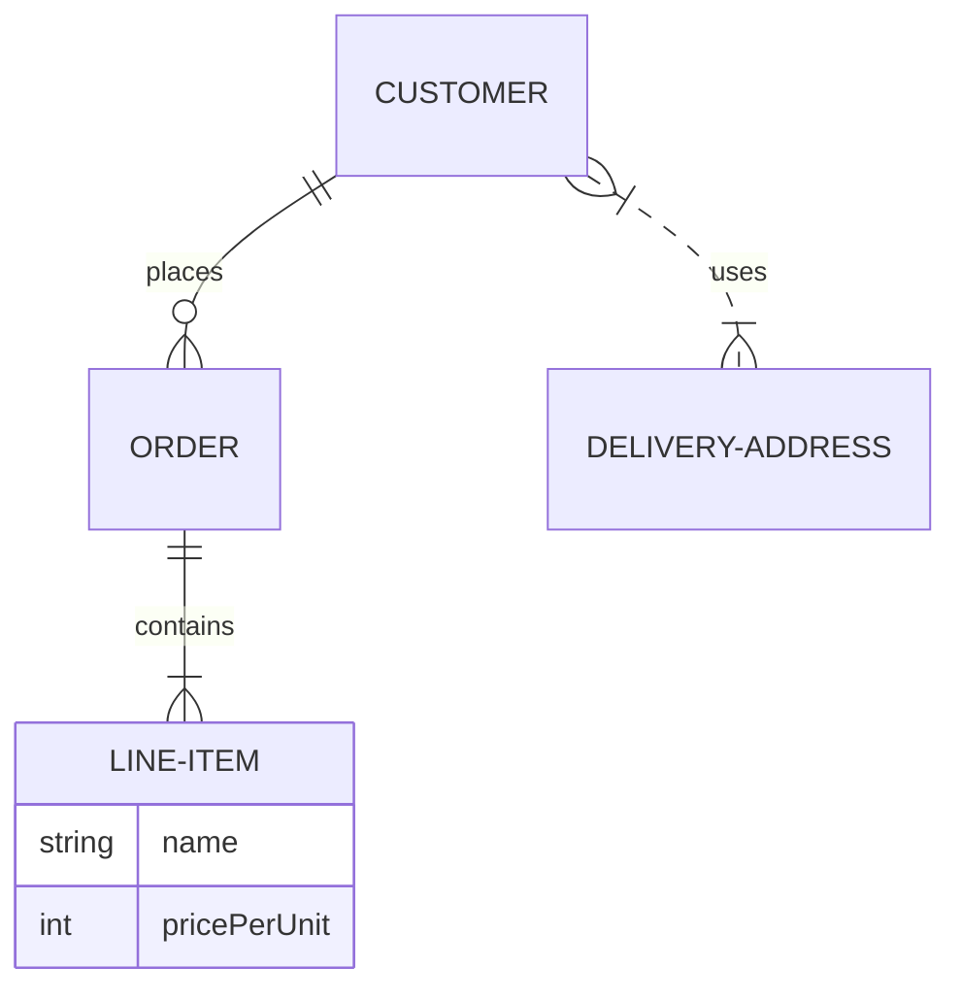

# Conseil pour Markdown

insérer une image avec changement de taille  
'''
{: style="width:600px"}
'''

pour aller à la ligne mettre 2 espaces

> voici un exemple poour aller à la ligne   loremhfjdfgjg

Pour créer un nouveau paragraphe appuyer sur entrée

!!! note-prof Notes enseignants

    Notes pour les enseignants

**attr**{style="color: red"}

!!! note

    Lorem ipsum dolor sit amet, consectetur adipiscing elit. Nulla et euismod nulla. Curabitur feugiat, tortor non consequat finibus, justo purus auctor massa, nec semper lorem quam in massa.

!!! abstract

    Lorem ipsum dolor sit amet, consectetur adipiscing elit. Nulla et euismod nulla. Curabitur feugiat, tortor non consequat finibus, justo purus auctor massa, nec semper lorem quam in massa.

!!! info

    Info
    
    Lorem ipsum dolor sit amet, consectetur adipiscing elit. Nulla et euismod nulla. Curabitur feugiat, tortor non consequat finibus, justo purus auctor massa, nec semper lorem quam in massa.

!!! tip
    Lorem ipsum dolor sit amet, consectetur adipiscing elit. Nulla et euismod nulla. Curabitur feugiat, tortor non consequat finibus, justo purus auctor massa, nec semper lorem quam in massa.

!!! success

    Lorem ipsum dolor sit amet, consectetur adipiscing elit. Nulla et euismod nulla. Curabitur feugiat, tortor non consequat finibus, justo purus auctor massa, nec semper lorem quam in massa.

!!! question

    Lorem ipsum dolor sit amet, consectetur adipiscing elit. Nulla et euismod nulla. Curabitur feugiat, tortor non consequat finibus, justo purus auctor massa, nec semper lorem quam in massa.

!!! warning

    Lorem ipsum dolor sit amet, consectetur adipiscing elit. Nulla et euismod nulla. Curabitur feugiat, tortor non consequat finibus, justo purus auctor massa, nec semper lorem quam in massa.

!!! Failure

    Lorem ipsum dolor sit amet, consectetur adipiscing elit. Nulla et euismod nulla. Curabitur feugiat, tortor non consequat finibus, justo purus auctor massa, nec semper lorem quam in massa.

!!! Danger

    Lorem ipsum dolor sit amet, consectetur adipiscing elit. Nulla et euismod nulla. Curabitur feugiat, tortor non consequat finibus, justo purus auctor massa, nec semper lorem quam in massa.

!!! Bug

    Lorem ipsum dolor sit amet, consectetur adipiscing elit. Nulla et euismod nulla. Curabitur feugiat, tortor non consequat finibus, justo purus auctor massa, nec semper lorem quam in massa.

!!! Example

    Lorem ipsum dolor sit amet, consectetur adipiscing elit. Nulla et euismod nulla. Curabitur feugiat, tortor non consequat finibus, justo purus auctor massa, nec semper lorem quam in massa.

??? quote
    Lorem ipsum dolor sit amet, consectetur adipiscing elit. Nulla et euismod nulla. Curabitur feugiat, tortor non consequat finibus, justo purus auctor massa, nec semper lorem quam in massa.

markdown-it-container
::::: container
:::: row
::: col-xs-6 alert alert-success
success text
:::
::: col-xs-6 alert alert-warning
warning text
:::
::::
:::::

!!! bug "Title{style="color:#FF00FF"}"
    Content



```markmap
# Mindmap

## Extension

- [markdown-markmap](https://github.com/phoihos/vscode-markdown-markmap)

## Powered by

- <https://markmap.js.org/>
- [markmap-lib](https://github.com/gera2ld/markmap-lib)

## Highlighting

- links
- **inline** ~~text~~ *styles*
- multiline
  text
- `inline code`
-   ```js
    console.log('code block');
```

```vegalite
{
  "description": "A simple bar chart with embedded data.",
  "data": {
    "values": [
      {"a": "A", "b": 28}, {"a": "B", "b": 55}, {"a": "C", "b": 43},
      {"a": "D", "b": 91}, {"a": "E", "b": 81}, {"a": "F", "b": 53},
      {"a": "G", "b": 19}, {"a": "H", "b": 87}, {"a": "I", "b": 52}
    ]
  },
  "mark": {"type": "bar", "tooltip": true},
  "encoding": {
    "x": {"field": "a", "type": "nominal", "axis": {"labelAngle": 0}},
    "y": {"field": "b", "type": "quantitative"}
  }
}
```

regex pour remplace balise Image
'''
 
    style="(.*?)" />
